# Perfil de Usuário

## Introdução

O perfil de usuário é uma descrição detalhada das características, interesses, comportamentos e necessidades de um determinado público-alvo. Ele tem como objetivo, entendermos mais sobre os usuários que utilizam o aplicativo selecionado para a análise do grupo. Para isso, é preciso coletar informações sobre esses usuários como quem são, seus objetivos, e também, seus dados demográficos. Assim, o perfil de usuário irá descrever detalhadamente as características dos usuários do aplicativo.

## Metodologia

Para a coleta de dados, foram empregadas duas técnicas: um questionário virtual e uma pesquisa baseada em estudos realizados pela plataforma SimilarWeb, que é especializada em análise de dados. O questionário foi criado utilizando o Google Forms, e os dados coletados foram apresentados em gráficos, o questionário foi divulgado em grupos do Facebook, WhatsApp e Telegram, a fim de alcançar um público diversificado e obter uma amostra mais representativa da população estudada. Os resultados estatísticos dos gráficos foram comparados com os dados da pesquisa da SimilarWeb, a fim de aumentar a precisão dos resultados obtidos.

## Política de confidencialidade dos dados

No questionário, é mencionado na primeira página que a participação é totalmente voluntária e que todas as respostas submetidas serão tratadas de forma confidencial conforme a figura 1 a seguir.

Figura 1 - Termo apresentado no questionário. (Fonte: Autores. 2023).

## Resultados

Com relação à pergunta 1, mostrada na Figura 2 - "Qual é o seu gênero?", constatou-se que 60% dos usuários do booking.com se identificam como homens, enquanto os demais 40% se identificam como mulheres.

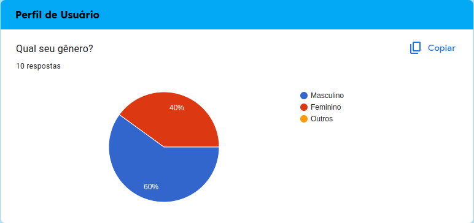

Figura 2 - Grafico de setores da pergunta 1.(Fonte: Autores. 2023).

Com relação à pergunta 2, mostrada na Figura 3 - "Qual é a sua idade?", verificou-se que a faixa etária mais representativa entre os participantes é de 25 a 34 anos, abrangendo 50% do total.

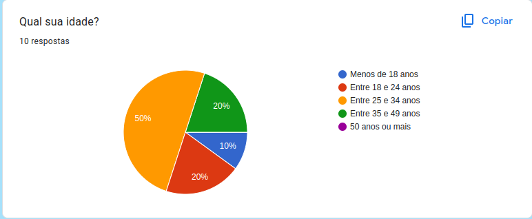

Figura 3 - Grafico de setores da pergunta 2.(Fonte: Autores. 2023).

Com relação à pergunta 3, mostrada na Figura 4 - "Qual é o seu estado civil?", constatou-se que metade das pessoas que responderam são solteiras, enquanto 30% são casadas.

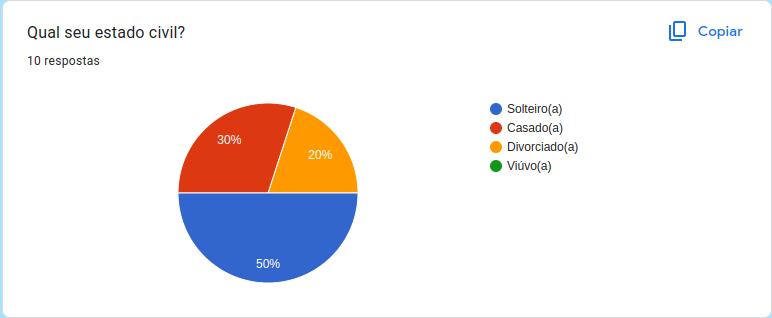

Figura 4 - Grafico de setores da pergunta 3.(Fonte: Autores. 2023).

Com relação à pergunta 4, mostrada na Figura 5 - "Com que frequência você utiliza o Booking.com?", observou-se que mais da metade dos participantes utilizam o aplicativo algumas vezes no mês.

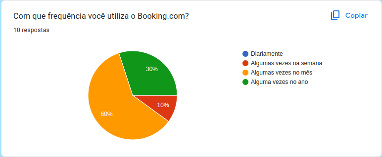

Figura 5 - Grafico de setores da pergunta 4.(Fonte: Autores. 2023).

Com relação à pergunta 5, mostrada na Figura 6 - "Em que tipo de acomodação você costuma se hospedar ao reservar pelo booking.com?", constatou-se que metade dos participantes preferem se hospedar em hotéis.

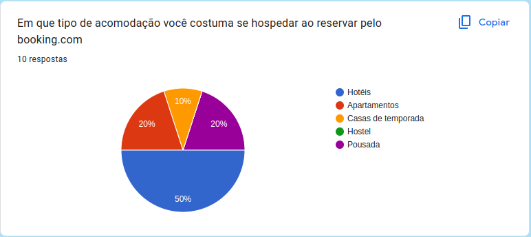

Figura 6 - Grafico de setores da pergunta 5.(Fonte: Autores. 2023).

Com relação à pergunta 6, mostrada na Figura 7 - "Qual é o seu principal motivo para usar o Booking.com?", verificou-se que a maioria dos indivíduos utiliza a plataforma para viajar a lazer.

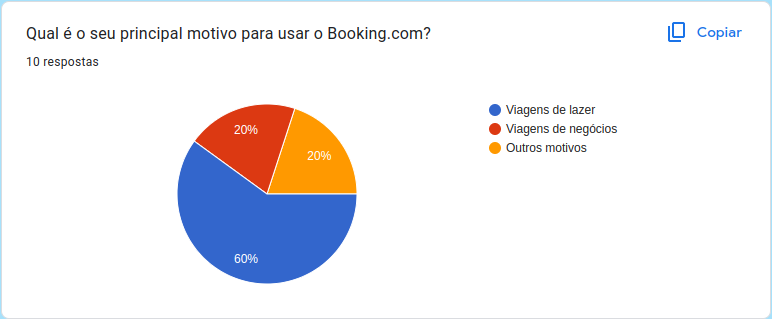

Figura 7 - Grafico de setores da pergunta 6.(Fonte: Autores. 2023).

Com relação à pergunta 7, mostrada na Figura 8 - Quanto tempo antes da viagem você costuma fazer sua reserva pelo Booking.com?, é possivel notar que os dados são mais distribuidos, porém existem mais pessoas que fazem sua reserva entre 1 e 4 semanas de antecedência.

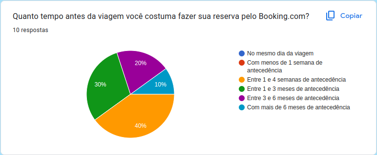

Figura 8 - Grafico de setores da pergunta 7.(Fonte: Autores. 2023).

Com relação à pergunta 8, mostrada na Figura 9 - Qual é a duração média da sua estadia em um hotel?, notamos uma semelhança com as proporções do gráfico anterior com a prevalência de uma média entre 2 e 5 noites de duração da estadia.

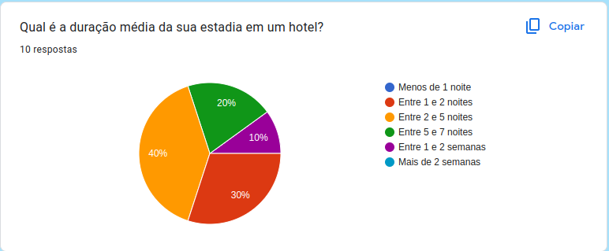

Figura 9 - Grafico de setores da pergunta 8.(Fonte: Autores. 2023).

Com relação à pergunta 9, mostrada na Figura 10 - Qual principal criterio que vc usa para selecionar um hotel no aplicativo?, é possivel notar que 50% dos participantes tem a localização como criterio de seleção de um hotel.

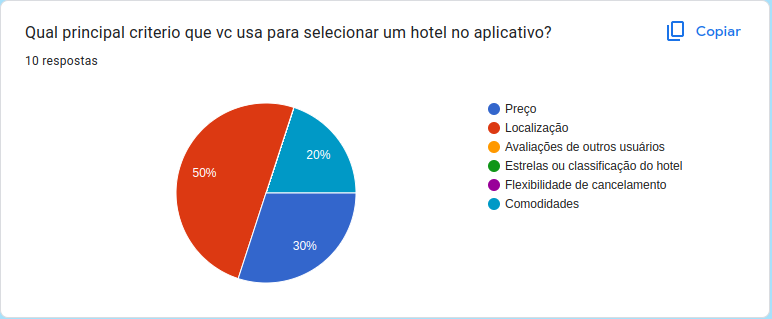

Figura 10 - Grafico de setores da pergunta 9.(Fonte: Autores. 2023).

Com base em uma consulta à pesquisa realizada pelo SimilarWeb, conforme ilustrado na Figura 11, é possível observar que 49,92% do público é composto por mulheres, enquanto 50,08% são homens. Além disso, a faixa etária predominante do público está entre 25 e 34 anos.

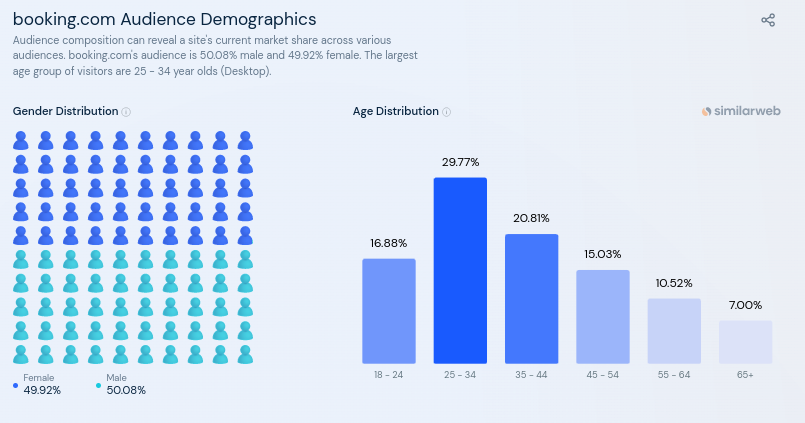

Figura 11 - Graficos de idade e gênero.(Fonte: SimilarWeb. 2017).

Baseado em uma consulta à pesquisa realizada pelo SimilarWeb, conforme ilustrado na Figura 12, é possível observar que o Booking.com recebe a maior parte do seu tráfego de mídia social do Facebook, seguido pelo YouTube e WhatsApp Webapp (Desktop).

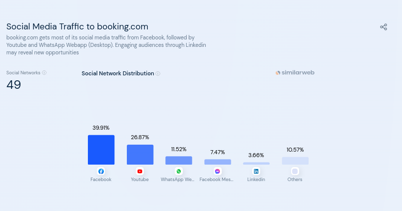

Figura 12 - Grafico de Tráfego de mídia social para booking.(Fonte: SimilarWeb. 2017).

## Conclusão

Com base nos resultados obtidos através do questionário, foi possível identificar o perfil dos usuários do aplicativo, que inclui tanto pessoas com menos de 18 anos quanto pessoas com 49 anos, com uma proporção quase igual de usuários homens e mulheres. A maioria dos usuários adultos se encontra na faixa etária entre 25 e 34 anos e são, em sua maioria, solteiros. Analisando o gráfico de frequência de utilização, é possível observar que a maioria dos usuários possui um nível intermediário de experiência em relação ao uso do aplicativo. Esses usuários têm alguma familiaridade com a tecnologia e são capazes de explorar as funcionalidades básicas do aplicativo. Eles utilizam o aplicativo principalmente para reservar hotéis e dão prioridade, em sua maioria, à localização da reserva. A seguir na tabela 1 é apresentado os perfis dos usuários.

|                   Perfil                   | A                                                | B                                                                      |
| :----------------------------------------: | ------------------------------------------------ | ---------------------------------------------------------------------- |
|             **Gênero**             | Em geral, usuários do sexo masculino           | Em geral, usuários do sexo masculino, mas podem ser do sexo feminino |
|              **Idade**              | Variam entre 25 e 34 anos de idade              | Entre 18 e 24 anos                                                     |
| **Frêquencia de uso do aplicativo** | Algumas vezes no ano                             | Algumas vezes no mês                                                  |
|   **Experiência com Tecnologia**   | Possuem certa facilidade com uso da tecnologia | Possuem facilidade com uso da tecnologia                               |
|   **Atitudes perante tecnologia**   | Tecnófilo                                       | Tecnófilo                                                             |
|        **Tarefas Primárias**        | resevar hoteis e carros                          | resevar hoteis                                                         |

Tabela 1 - Perfil dos usuários.(Fonte: Autores. 2023).

## Bibliografia

Similarweb. Disponível em: [https://www.similarweb.com/website/booking.com/#geography](https://www.similarweb.com/website/booking.com/#geography). Acesso em: 19 abr. 2023.

BARBOSA, Simone; SILVA, INTERAÇÃO HUMANO-COMPUTADOR. Local de publicação: Elsevier Editora Ltda, 2010.

## Histórico de Versão

| Versão | Data       | Descrição                             | Autor(es)                 | Revisor(es) |
| ------- | ---------- | --------------------------------------- | ------------------------- | ----------- |
| 1.0     | 18/04/2023 | Criação da página Perfil de Usuário | Henrique e Pedro Henrique | Gabriel     |
| 1.1     | 10/05/2023 | Adicionando a tecnofilia do usuario     | Henrique e Pedro Henrique | Samuel      |
| 1.2     | 21/06/2023 | Adicionando correções apontadas pela verificação     | Henrique e Pedro Henrique | Samuel      |
