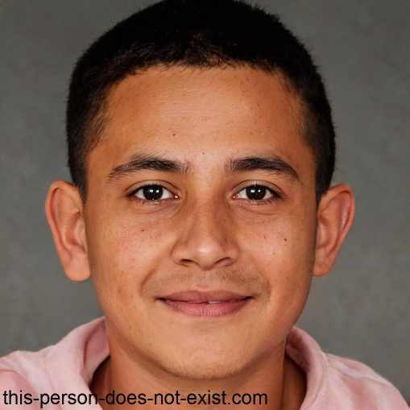
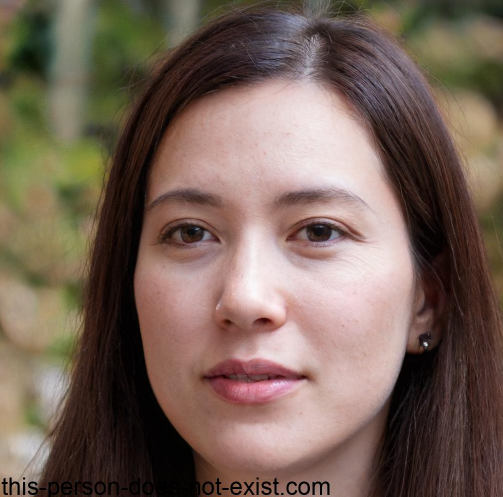
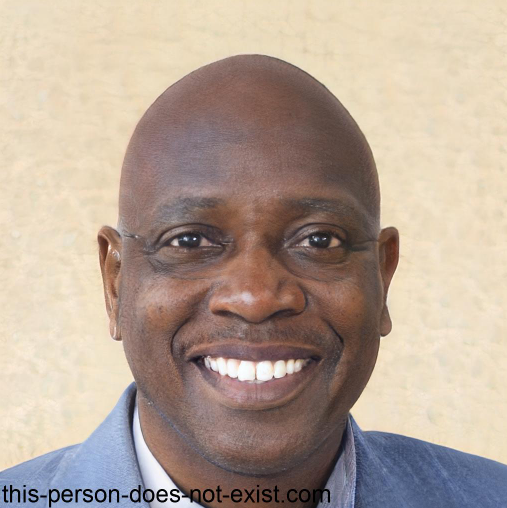
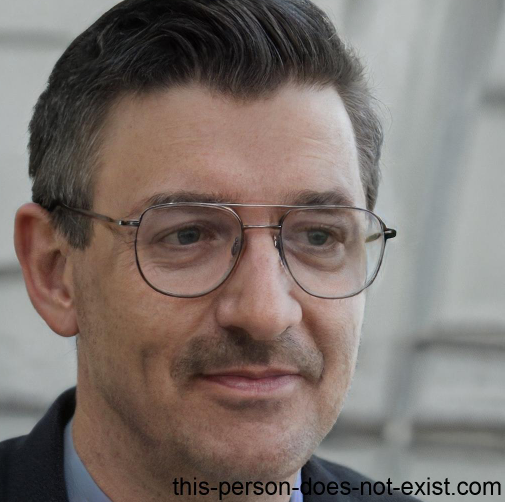

# Personas

## Introdução

Bem-vindo à página de personas do projeto! Aqui você encontrará uma lista de personas e antipersonas que serão utilizados para projeto. Essas personas são pessoas ficticias, para definir nosso público-alvo, o qual foram selecionadas e baseadas no perfil de usuário[1].

Segundo o livro Interação Humano - Computador[2], o objetivo de usar personas é almejar uma compreensão mais profunda dos usuários finais e a criar empatia com os usuários finais, sendo assim, permitindo nos colocássemos no lugar deles, por tanto entendendo melhor suas perspectivas, experiências e necessidades. Outro grande motivo do uso de personas é para manter o foco nos usuários finais e a criar soluções que atendam às suas necessidades de maneira eficaz e centrada no usuário. Por isso, nós enxergamos como fundamental a elaboração de personas para a construção da elicitação de requisitos.

Escolhemos trabalhos com 3 personas, pois de acordo com Courage e Baxter (2005), esse é o valor mínimo de personas para se construir uma boa analíse. Uma antipersona também foi criada para que tenhamos sempre em mente qual será o tipo de usuário que não utilizará o sistema.

## Personas

Primeiramente, na Tabela 1, temos as características de nossa primeira Persona, Paulo Fernando:

|                                                                                                                                                                                                            |
| :--------------------------------------------------------------------------------------------------------------------------------------------------------------------------------------------------------------------------------------------------: |
|                                                                                                        **Nome:** Paulo Fernando Ribas                                                                                                        |
|                                                                                                             **Gênero:** Masculino                                                                                                             |
|                                                                                                                 **Idade: 20**                                                                                                                 |
|                                                                                                     **Escolaridade:** Superior incompleto                                                                                                     |
|                                                                                                  **Profissão:** Estagiário de Programação                                                                                                  |
|                                                                                                   **Relacionamentos:** Solteiro, sem filhos                                                                                                   |
|                                                                                                         **Status:** Persona primária                                                                                                         |
|                                                            **Objetivos:** Fernando Ribas é um jovem que ama viajar, pois ama conhecer novos lugares e aprender com outras culturas                                                            |
|                                **Habilidades:** Por ser tratar de um jovem, Fernando sempre teve contato com tecnologias desde cedo. Por isso, não tem dificuldades relacionadas ao uso de serviços virtuais                                |
| **Tarefas:** Durante o dia Fernando acorda e vai para a faculdade, depois de passar o dia estudando ele volta para casa para estagiar, pois ele trabalha de forma remota. Porém, durante as férias ele gosta de viajar para lugares bonitos. |
|                                                      **Requisitos:** Fernando gostaria que as reservas de hoteis e pousadas fossem menos burocráticas e feitas de maneira mais eficiente                                                      |
|                                                                      **Expectativas:** Ele acredita que o booking.com pode lhe dar as melhores promoções de hospedagem                                                                      |

 Tabela 1: Persona Primária 1, versão 1. (Fonte: Autores. 2023).

A seguir, na Tabela 2, temos as características de nossa segunda Persona, Daniela Stella:

|                                                                                                                                                                                    |
| :------------------------------------------------------------------------------------------------------------------------------------------------------------------------------------------------------------------------------: |
|                                                                                               **Nome:** Daniela Stella Melo                                                                                               |
|                                                                                                        Gênero: Feminino                                                                                                        |
|                                                                                                       **Idade: 31**                                                                                                       |
|                                                                                                 Escolaridade: Superior completo                                                                                                 |
|                                                                                                 **Profissão:** Arquiteta                                                                                                 |
|                                                                                         **Relacionamentos:** Casada e tem 2 filhos                                                                                         |
|                                                                                              **Status:** Persona secundária                                                                                              |
|          **Objetivos:** Daniela ama a sua família e preza muito por tempo de qualidade com eles. Por isso, nos feriados e fins de semana eles sempre alugam uma casa na praia para curtirem um momento juntos.          |
| **Habilidades:** Por razões profissionais ele acaba tendo muito contato com certos tipos de tecnologia. Porém ela considera valioso o tempo fora do celular, pois ela sente que nada substitui as relações presenciais |
|                  **Tarefas:** Ela trabalha em seu escritório de segunda à sexta feira e nos fins de semana ela arruma as malas, o seu marido faz as reservas de onde eles irão passar o fim de semana.                  |
|                                         **Requisitos:** Daniela gostaria que fosse possível adicionar companheiros de viagem para facilitar na hora de fazer a reserva do local.                                         |
|               **Expectativas:** Daniela acha que com o Booking.com a sua família terá mais segurança ao realizar a reserva, porque ficará mais fácil de fazer a gestão de pessoas que irão na viagem               |

 Tabela 2: Persona Secundária 1, versão 1. (Fonte: Autores. 2023).

Por último, na Tabela 3, temos as características de nossa terceira e última Persona, Sebastião Leonardo:

|                                                                                                                                                                                                                            |
| :----------------------------------------------------------------------------------------------------------------------------------------------------------------------------------------------------------------------------------------------------------------------------: |
|                                                                                                                     **Nome: **Sebastião Leonardo Freitas                                                                                                                     |
|                                                                                                                          **Gênero:** Masculino                                                                                                                          |
|                                                                                                                              **Idade:** 45                                                                                                                              |
|                                                                                                                    **Escolaridade:** Ensino Superior                                                                                                                    |
|                                                                                                                   **Profissão:** Professor de Física                                                                                                                   |
|                                                                                                                 **Relacionamentos:** Divorciado, 1 Filha                                                                                                                 |
|                                                                                                                      **Status:** Persona Primária                                                                                                                      |
| **Objetivos:** Sebastião realiza trabalhos para feiras cientificas e por esse motivo tem que viajar para diversos lugares do mundo, levando até sua filha em algumas viagens. Por isso, ele sempre aluga um carro a depender do local, faz reserva de voo e hospedagem |
|                                                                         **Habilidades:** Por viajar muito, Sebastião tem conhecimento sobre aplicativos de hospedagem para saber eles funcionam                                                                         |
|                   **Tarefas:** Ele trabalha com sua pesquisa das 8:00 às 15:00, logo em seguida realiza suas atividades diárias como fazer exercícios, conversa com a sua filha, e verificar se existe algum problema com os seus planos de viagem.                   |
|                                                               **Requisitos:** Sebastião gostaria de poder alugar modelos de carros potentes e viagens e hospedagens em locais pertos de irá trabalhar                                                                |
|                                                                       **Expectativas:** Sebastião quer poder viaja sem muitas preocupações com  o local e transporte utilizando o Booking.com                                                                       |

 Tabela 3: Persona Primária 2, versão 1. (Fonte: Autores. 2023).

## Antipersona

Agora, na Tabela 4, temos as características de nossa Antipersona, Augusto Bento Calebe:

|                                                                                                                                                                                                                                                                                                                                                                      |
| :-----------------------------------------------------------------------------------------------------------------------------------------------------------------------------------------------------------------------------------------------------------------------------------------------------------------------------------------------------------------------------------------------------------------: |
|                                                                                                                                                                                       **Nome: **Augusto Bento Calebe Farias                                                                                                                                                                                       |
|                                                                                                                                                                                            **Gênero:** Masculino                                                                                                                                                                                            |
|                                                                                                                                                                                                 **Idade: 55**                                                                                                                                                                                                 |
|                                                                                                                                                                              **Escolaridade:** Ensino Fundamental (Incompleto))                                                                                                                                                                              |
|                                                                                                                                                                                   **Profissão:** Aposentado(por Invalidez)                                                                                                                                                                                   |
|                                                                                                                                                                                     **Relacionamentos:** Viúvo, 1 Filha                                                                                                                                                                                     |
|                                                                                                                                                                                            **Status:** Antipersona                                                                                                                                                                                            |
|      **Objetivos:** Augusto é um homem caseiro, se aposentou aos 54 anos devido a um acidente em viagem ao exterior em que perdeu a esposa e lhe fez ficar de cadeira de rodas e sentir dores crônicas, conseguindo assim se aposentar por invalidez quando retornou. O mesmo apesar de  antes gostasse de viajar ganhou um trauma depois da viagem por esse motivo se abstem de pensar em viagens.      |
|                                                                         **Habilidades:** Augusto não era adepto da tecnlogia, tinha pouco contato com mesma, por não possui ensino fundamental completo, dificultava ele conseguir mexer nas novas tecnlogias, que fazia reserva de viagens e ajeitava tudo era sua esposa e filha.                                                                         |
| **Tarefas:** No dia-a-dia de Augusto ele se tornou um homem caseiro, o qual gosta de fazer passeios no bairro da sua cidade, apesar de suas dificuldades, esses passeios costumam se das 8:00 às 9:00, depois ele vai para sua fisioterapia que acontece das 10:00 ao 13:00, e passa o restante do dia assisitindo tv algo para passar o dia, apesar de ter ganhado um recente interesse em começar a ler. |
|                                                                                                                                                         **Expectativas:** Não tem interesses em utilizar o aplicativo devido a trauma com  viagens                                                                                                                                                         |

 Tabela 4: Antipersona 1, versão 1. (Fonte: Autores. 2023).

## Referência Bibliográfica

[1] Perfil de Usuário. Disponível em :  https://requisitos-de-software.github.io/2023.1-Booking/elicitacao/perfilDeUsuario/ .Acesso em 23 de abril de 2023‌

[2]  BARBOSA, Simone Diniz Junqueira; DA SILVA, Bruno Santana. Interação Humano - Computador. Rio de janeiro: Elsevier, 2010. Acesso em 23 de abril de 2023.

Courage, Catherine e Baxter, Kathy (2005). Understanding Your Users: A Practical Guide to User
Requirements Methods, Tools, and Techniques. Morgan Kaufmann Publishers Inc., San Francisco,
CA, USA, 1st edition.

## Bibliografia

‌This Person Does not exist. Disponível em: https://this-person-does-not-exist.com/en. Acesso em 23 de abril de 2023.

## Histórico de Versão

| Versão | Data       | Descrição                                           | Autor(es)          | Revisor(es)     |
| ------- | ---------- | ----------------------------------------------------- | ------------------ | --------------- |
| 1.0     | 23/04/2023 | Criação da página de personas                      | Chaydson e Gabriel | Lucas           |
| 1.3     | 24/04/2023 | Adicionando referênciação para as tabelas          | Henrique           | Lucas           |
| 1.4     | 10/05/2023 | Adicionando correções apontadas pós apresentação | Chaydson           | Lucas e Gabriel |
