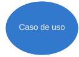

# Casos de uso

## Introdução

Um diagrama de casos de uso é uma ferramenta que permite representar graficamente as interações entre os usuários e um sistema. Ele mostra quais são os atores envolvidos, quais são os cenários possíveis e quais são os objetivos que o sistema deve atender. Um diagrama de casos de uso é composto por elementos como atores, casos de uso, relacionamentos e limites do sistema. Ele faz parte da linguagem de modelagem unificada (UML), que é um padrão para especificar e documentar sistemas de software.

## Metodologia

O diagrama de casos de uso foi elaborado a partir dos principais requisitos identificados através dos métodos de [brainstorming](../elicitacao/brainstorm.md), [observação](../elicitacao/observacao.md) e [storytelling](../elicitacao/storytelling.md). Posteriormente, o diagrama foi validado por um participante que interpretou o papel do cliente e não possuía vínculo com o grupo.

## Componentes

A Tabela 1 fornece uma visão geral dos componentes de um diagrama de caso de uso e sua descrição.

| Componente                                                         | Descrição                                                                                        |
| ------------------------------------------------------------------ | -------------------------------------------------------------------------------------------------- |
|                               | Representa um usuário ou sistema externo que interage com o sistema em questão.                  |
|                    | Descreve uma funcionalidade do sistema que atende a uma necessidade do usuário.                   |
|  | Conecta o ator ao caso de uso correspondente.                                                      |
|                          | Indica que um caso de uso é incluído em outro caso de uso.                                       |
|                          | Indica que um caso de uso pode ser estendido por outro caso de uso em certas condições.          |
|                              | As bordas dos casos de uso definem os limites e interações entre os atores externos e o sistema. |

 Tabela 1: Componentes do Diagrama de Casos de Uso (Fonte: Autor, 2023). 

## Digrama de Casos de Uso

A Figura 1 mostra o diagrama de casos de uso do sistema do aplicativo Booking.

 Figura 1: Diagrama de Casos de Uso (Fonte: Autor, 2023). 

## Especificação do diagrama de caso de uso

As informações contidas nas especificações do diagrama de caso de uso são essenciais para o sucesso do processo de desenvolvimento de software. Elas apresentam detalhes sobre os atores envolvidos, suas funções e interações com o sistema, além de fornecer descrições minuciosas dos casos de uso e suas relações com outros casos de uso.

### Legenda

UC: Use Case (caso de uso)

FST: Requisito funcional de Storytelling

FOBS: Requisito funcional da Observação

FB - Requisito Funcional Brainstorm

### UC01 - Criar conta

As especificações para o caso de uso "criar conta" são apresentadas na Tabela 1.

| UC01                          | Criar conta                                                                                                                                                                                                                                                                                                                                                                                                                                                                                                                                                                 |
| ----------------------------- | --------------------------------------------------------------------------------------------------------------------------------------------------------------------------------------------------------------------------------------------------------------------------------------------------------------------------------------------------------------------------------------------------------------------------------------------------------------------------------------------------------------------------------------------------------------------------- |
| **Ator**                | Hóspede                                                                                                                                                                                                                                                                                                                                                                                                                                                                                                                                                                    |
| **Requisitos**          | O Hóspede deve fornecer informações pessoais e de contato válidas.                                                                                                                                                                                                                                                                                                                                                                                                                                                                                                      |
| **pré-condição**     | O Hóspede acessa a página de registro do sistema.                                                                                                                                                                                                                                                                                                                                                                                                                                                                                                                         |
| **Fluxo principal**     | 1. O Hóspede preenche o formulário de registro com suas informações pessoais e de contato. 2. O Hóspede confirma as informações e envia o formulário. 3. O sistema verifica as informações e cria uma conta para o Hóspede.                                                                                                                                                                                                                                                                                                                          |
| **Fluxos alternativos** | 3a. Se as informações fornecidas pelo Hóspede são inválidas ou incompletas, o sistema exibe uma mensagem de erro e solicita que o Hóspede corrija o formulário.                                                                                                                                                                                                                                                                                                                                                                                                      |
| **Fluxos de exceção** | 2a. Se o Hóspede tentar enviar o formulário sem preencher todos os campos obrigatórios, o sistema exibe uma mensagem de erro e destaca os campos que devem ser preenchidos. 3b. Se o sistema não conseguir se conectar ao servidor de autenticação, o sistema exibe uma mensagem de erro e informa que a criação da conta não pode ser realizada no momento. 3a. Se as informações de contato fornecidas pelo Hóspede forem inválidas, o sistema exibe uma mensagem de erro específica, informando que as informações de contato são inválidas. |
| **Pós-condição**     | O Hóspede tem uma conta registrada no sistema.                                                                                                                                                                                                                                                                                                                                                                                                                                                                                                                             |
| **Rastreabilidade**     | [FST01](../elicitacao/storytelling.md)                                                                                                                                                                                                                                                                                                                                                                                                                                                                                                                                         |

 Tabela 1: especificações para o caso de uso "criar conta" (Fonte: Autor, 2023). 

### UC02 - Realizar pesquisa

As especificações para o caso de uso "Realizar pesquisa" são apresentadas na Tabela 2.

| UC02                          | Realizar pesquisa                                                                                                                                                                                                                                                                                                                                                                                                                                                                                                                                                                                                                                                 |
| ----------------------------- | ----------------------------------------------------------------------------------------------------------------------------------------------------------------------------------------------------------------------------------------------------------------------------------------------------------------------------------------------------------------------------------------------------------------------------------------------------------------------------------------------------------------------------------------------------------------------------------------------------------------------------------------------------------------- |
| **Ator**                | Hóspede                                                                                                                                                                                                                                                                                                                                                                                                                                                                                                                                                                                                                                                          |
| **Requisitos**          | O sistema deve possuir a funcionalidade de pesquisa de acomodações                                                                                                                                                                                                                                                                                                                                                                                                                                                                                                                                                                                              |
| **pré-condição**     | O Hóspede acessa a página de pesquisa do sistema.                                                                                                                                                                                                                                                                                                                                                                                                                                                                                                                                                                                                               |
| **Fluxo principal**     | 1. O Hóspede insere os critérios de pesquisa, como localização, data de check-in, data de check-out e número de hóspedes. 2. O sistema busca por acomodações que atendam aos critérios de pesquisa do Hóspede. 3. O sistema exibe os resultados da pesquisa ao Hóspede.                                                                                                                                                                                                                                                                                                                                                                      |
| **Fluxos alternativos** | 3a. Se não houver acomodações disponíveis que atendam aos critérios de pesquisa, o sistema exibe uma mensagem informando que não há acomodações disponíveis para as datas selecionadas.                                                                                                                                                                                                                                                                                                                                                                                                                                                                 |
| **Fluxos de exceção** | 1b. Se o Hóspede inserir critérios de pesquisa inválidos, como uma data de check-in posterior à data de check-out, o sistema exibe uma mensagem de erro e solicita que o Hóspede corrija os dados. 2c. Se o sistema não conseguir se conectar ao banco de dados das acomodações, o sistema exibe uma mensagem de erro e informa que a pesquisa não pode ser realizada no momento. 3d. Se o Hóspede clicar em uma acomodação nos resultados da pesquisa, mas a acomodação não estiver mais disponível, o sistema exibe uma mensagem informando que a acomodação foi reservada por outro usuário e atualiza os resultados da pesquisa. |
| **Pós-condição**     | O Hóspede visualiza os resultados da pesquisa de acomodações disponíveis.                                                                                                                                                                                                                                                                                                                                                                                                                                                                                                                                                                                     |
| **Rastreabilidade**     | [FOBS02](../elicitacao/observacao.md)                                                                                                                                                                                                                                                                                                                                                                                                                                                                                                                                                                                                                                |

 Tabela 2: especificações para o caso de uso "Realizar pesquisa" (Fonte: Autor, 2023). 

### UC03 - Reservar acomodação

As especificações para o caso de uso "Reservar acomodação" são apresentadas na Tabela 3.

| UC03                          | Reservar acomodação                                                                                                                                                                                                                                                                  |
| ----------------------------- | -------------------------------------------------------------------------------------------------------------------------------------------------------------------------------------------------------------------------------------------------------------------------------------- |
| **Ator**                | Hóspede                                                                                                                                                                                                                                                                               |
| **Requisitos**          | O Hóspede deve estar logado no sistema e haver pelo menos uma acomodação disponível para as datas selecionadas.                                                                                                                                                                    |
| **pré-condição**     | O Hóspede seleciona uma acomodação disponível para reserva.                                                                                                                                                                                                                        |
| **Fluxo principal**     | 1. O Hóspede seleciona uma acomodação disponível que atenda às suas necessidades. 2. O sistema exibe um formulário de reserva para o Hóspede preencher. 3. O Hóspede confirma a reserva. 4. O sistema notifica o Proprietário da acomodação sobre a reserva. |
| **Fluxos alternativos** | 2a. Se a acomodação selecionada já não estiver disponível, o sistema exibe uma mensagem informando que a acomodação já foi reservada por outro hóspede.                                                                                                                       |
| **Fluxos de exceção** | 3a. Se o Hóspede não confirma a reserva, a reserva não é efetivada e o sistema exibe uma mensagem de confirmação.                                                                                                                                                                |
| **Pós-condição**     | O Hóspede tem uma reserva confirmada na acomodação selecionada.                                                                                                                                                                                                                     |
| **Rastreabilidade**     | [FST03](../elicitacao/storytelling.md)                                                                                                                                                                                                                                                    |

 Tabela 3: especificações para o caso de uso "Reservar acomodação" (Fonte: Autor, 2023). 

### UC04 - Realizar pagamento

As especificações para o caso de uso "Realizar pagamento" são apresentadas na Tabela 4.

| UC04                          | Realizar pagamento                                                                                                                                                                                                                                                                                                                                                                                                                                                         |
| ----------------------------- | -------------------------------------------------------------------------------------------------------------------------------------------------------------------------------------------------------------------------------------------------------------------------------------------------------------------------------------------------------------------------------------------------------------------------------------------------------------------------- |
| **Atores**              | Hóspede e Serviço de Pagamento                                                                                                                                                                                                                                                                                                                                                                                                                                           |
| **Requisitos**          | O Hóspede deve ter uma reserva confirmada e deve escolher um dos métodos de pagamento disponíveis.                                                                                                                                                                                                                                                                                                                                                                      |
| **pré-condição**     | O Hóspede acessa a página de pagamento do sistema.                                                                                                                                                                                                                                                                                                                                                                                                                       |
| **Fluxo principal**     | 1. O Hóspede escolhe um dos métodos de pagamento disponíveis, como cartão de crédito, cartão de débito ou PIX. 2. O Hóspede insere as informações de pagamento necessárias para o método escolhido. 3. O sistema processa o pagamento e confirma a transação.                                                                                                                                                                                     |
| **Fluxos alternativos** | 1a. Se o Hóspede escolheu o método de pagamento com cartão de crédito, o sistema redireciona o Hóspede para a página de pagamento com cartão de crédito. 1b. Se o Hóspede escolheu o método de pagamento com cartão de débito, o sistema redireciona o Hóspede para a página de pagamento com cartão de débito. 1c. Se o Hóspede escolheu o método de pagamento com PIX, o sistema redireciona o Hóspede para a página de pagamento com PIX. |
| **Fluxos de exceção** | 2a. Se as informações de pagamento fornecidas pelo Hóspede forem inválidas ou incompletas, o sistema exibe uma mensagem de erro e solicita que o Hóspede corrija o formulário. 3a. Se o sistema não consegue processar o pagamento, o sistema exibe uma mensagem informando que o pagamento não pôde ser processado.                                                                                                                                         |
| **Pós-condição**     | O Hóspede paga pela reserva com sucesso e recebe uma confirmação da transação.                                                                                                                                                                                                                                                                                                                                                                                        |
| **Rastreabilidade**     | [FB02](../elicitacao/brainstorm.md)                                                                                                                                                                                                                                                                                                                                                                                                                                           |

 Tabela 4: especificações para o caso de uso "Realizar pagamento" (Fonte: Autor, 2023). 

### UC05 - Alugar carros

As especificações para o caso de uso "Alugar carros" são apresentadas na Tabela 5.

| UC05                          | Alugar carros                                                                                                                                                                                                                                                       |
| ----------------------------- | ------------------------------------------------------------------------------------------------------------------------------------------------------------------------------------------------------------------------------------------------------------------- |
| **Ator**                | Hóspede e Locadora de Carros                                                                                                                                                                                                                                       |
| **Requisitos**          | O Hóspede deve estar logado no sistema e deve haver pelo menos um carro disponível para aluguel.                                                                                                                                                                  |
| **pré-condição**     | O Hóspede seleciona um carro disponível para aluguel.                                                                                                                                                                                                             |
| **Fluxo principal**     | 1. O Hóspede seleciona um carro disponível que atenda às suas necessidades. 2. O sistema exibe um formulário de aluguel para o Hóspede preencher. 3. O Hóspede confirma o aluguel. 4. O sistema notifica a Locadora de Carros sobre o aluguel. |
| **Fluxos alternativos** | 2a. Se o carro selecionado já não estiver disponível, o sistema exibe uma mensagem informando que o carro já foi alugado por outro hóspede.                                                                                                                    |
| **Fluxos de exceção** | 3a. Se o Hóspede não confirma o aluguel, o aluguel não é efetivado e o sistema exibe uma mensagem de confirmação.                                                                                                                                             |
| **Pós-condição**     | O Hóspede tem um aluguel de carro confirmado na data selecionada.                                                                                                                                                                                                  |
| **Rastreabilidade**     | [FST07](../elicitacao/storytelling.md)                                                                                                                                                                                                                                 |

 Tabela 5: especificações para o caso de uso "Alugar carros" (Fonte: Autor, 2023). 

### UC06 - Agendar voos

As especificações para o caso de uso "Agendar voos" são apresentadas na Tabela 6.

| UC06                          | Agendar voos                                                                                                                                                                                                                                                                    |
| ----------------------------- | ------------------------------------------------------------------------------------------------------------------------------------------------------------------------------------------------------------------------------------------------------------------------------- |
| **Atores**              | Hóspede e Companhia aérea                                                                                                                                                                                                                                                     |
| **Requisitos**          | O Hóspede deve estar logado no sistema e deve haver pelo menos um voo disponível para reserva.                                                                                                                                                                                |
| **pré-condição**     | O Hóspede seleciona um voo disponível para reserva.                                                                                                                                                                                                                           |
| **Fluxo principal**     | 1. O Hóspede seleciona um voo disponível que atenda às suas necessidades. 2. O sistema exibe um formulário de reserva de voo para o Hóspede preencher. 3. O Hóspede confirma a reserva de voo. 4. O sistema notifica a Companhia Aérea sobre a reserva. |
| **Fluxos alternativos** | 2a. Se o voo selecionado já não estiver disponível, o sistema exibe uma mensagem informando que o voo já foi reservado por outro hóspede.                                                                                                                                  |
| **Fluxos de exceção** | 3a. Se o Hóspede não confirma a reserva, a reserva não é efetivada e o sistema exibe uma mensagem de confirmação.                                                                                                                                                         |
| **Pós-condição**     | O Hóspede tem uma reserva de voo confirmada na data selecionada.                                                                                                                                                                                                               |
| **Rastreabilidade**     | [FOBS07](../elicitacao/observacao.md)                                                                                                                                                                                                                                              |

 Tabela 6: especificações para o caso de uso "Agendar voos" (Fonte: Autor, 2023). 

## Validação do Diagrama de Casos de Uso com o cliente

Foi realizado a validação do Diagrama de Casos de Uso por meio da interpretação de um cliente por um convidado externo, sem vínculo com o grupo. A validação completa pode ser encontrada no Video 1:

<iframe width="560" height="315" src="https://www.youtube.com/embed/vnYu-vbHGOM" title="YouTube video player" frameborder="0" allow="accelerometer; autoplay; clipboard-write; encrypted-media; gyroscope; picture-in-picture; web-share" allowfullscreen></iframe>

 Video 1: Entrevista (Fonte: Samuel, 2023). 

## Participantes

A Tabela 7 apresenta os participantes da entrevista.

| Entrevistador         | Entrevistado          | Local, data e hora            |
| --------------------- | --------------------- | ----------------------------- |
| Samuel Gomes de Souza | Pedro Gonçalves Rosa | Teams - 14/05/2023 às 19:52 |

 Tabela 7: Participantes da entrevista (Fonte: Autor, 2023). 

## Termo de consentimento

[Termo de consentimento](../assets/pdfs/Termo%20de%20Consentimento%20Validacao%20Diagrama%20de%20Casos%20de%20Uso%20-%20Clicksign.pdf)

## Bibliografia

COCKBURN, A. Escrevendo casos de uso eficazes: um guia prático para os requisitos de software. 2. ed. Porto Alegre: Bookman, 2005.

JACOBSON, I.; BOOCH, G.; RUMBAUGH, J. O processo unificado explicado. São Paulo: Addison Wesley, 2000.

## Histórico de versão

| Versão |    Data    |      Descrição      | Autor | Revisor |
| :-----: | :--------: | :--------------------: | :----: | :------: |
|   1.0   | 14/05/2023 | Criação do documento | Samuel | Henrique |
|   1.1   | 04/07/2023 | Correção do artefato | Samuel |  Lucas  |
