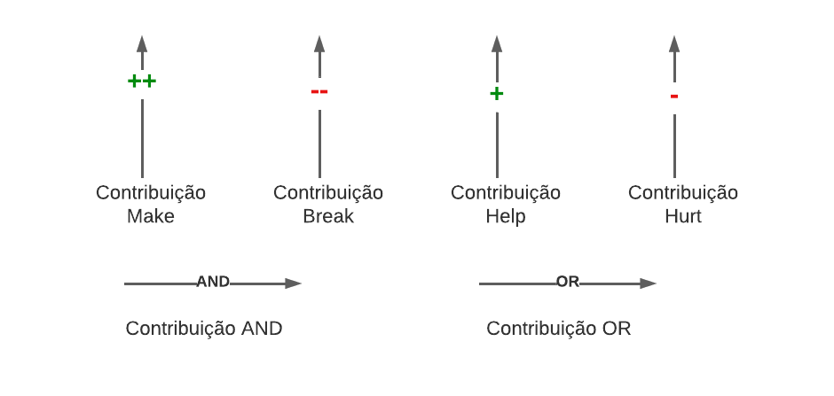
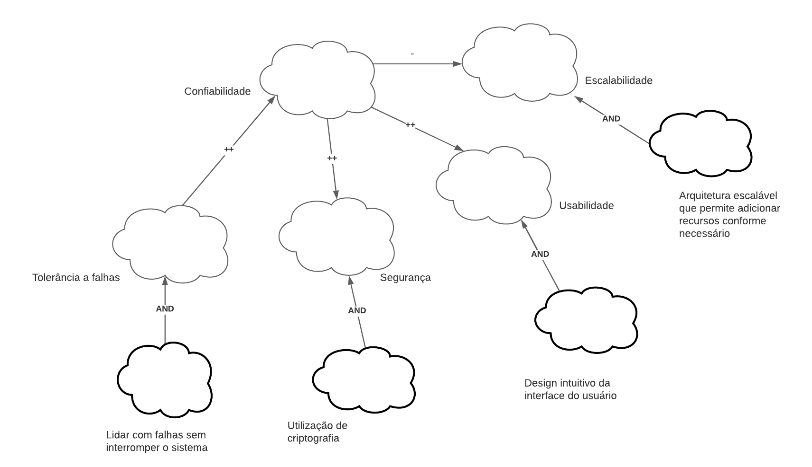
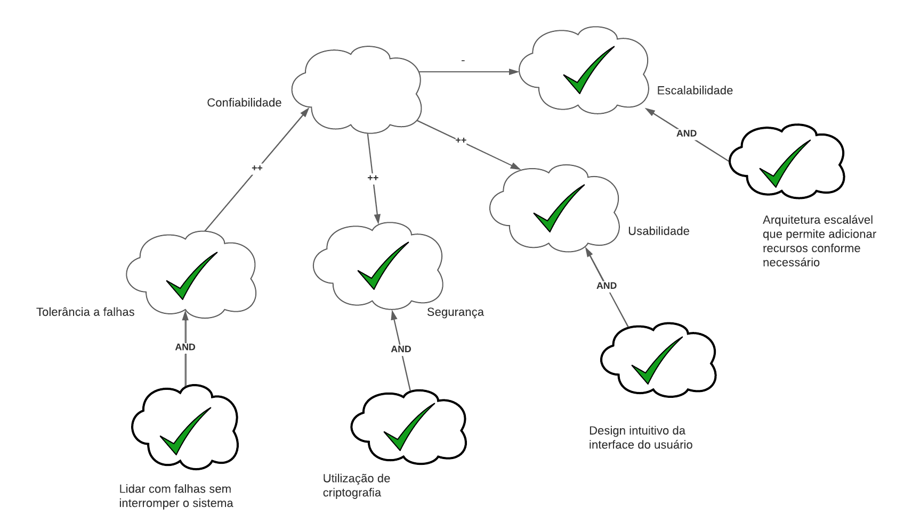
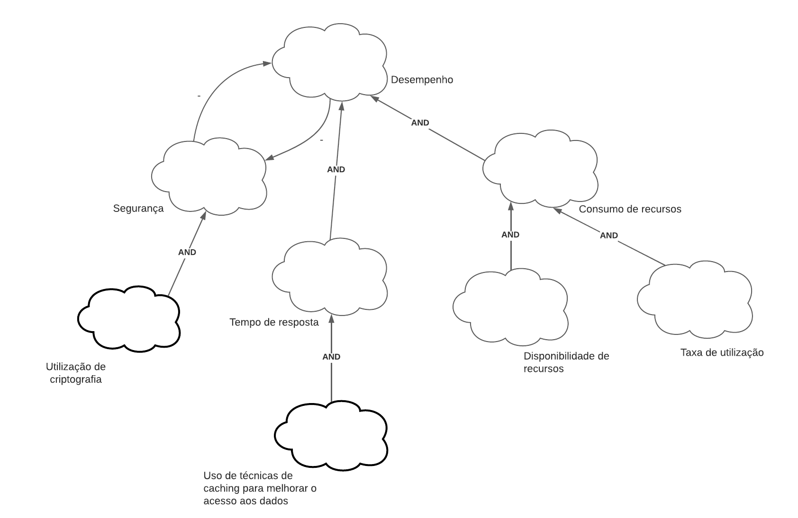
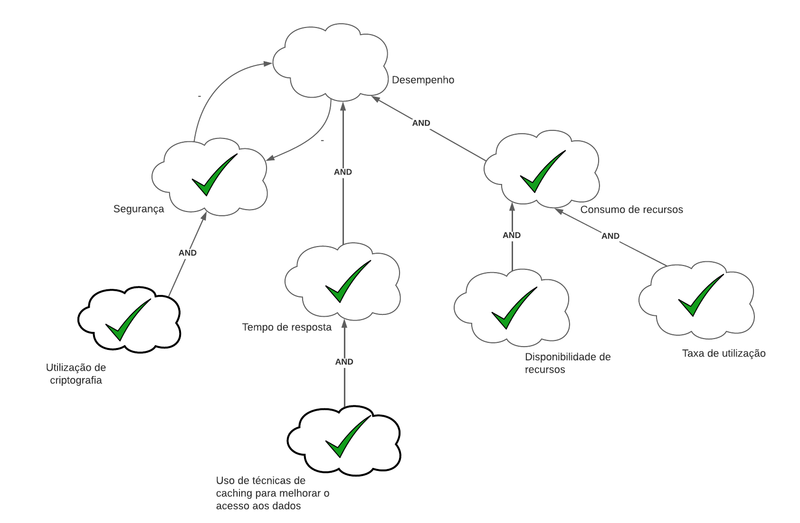
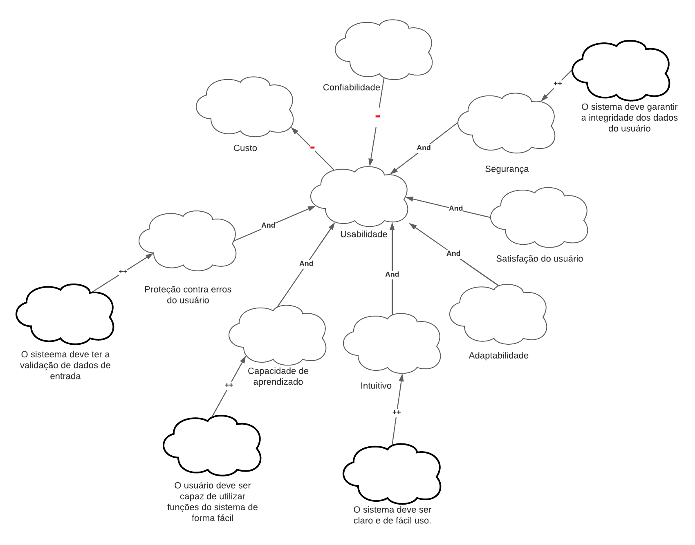
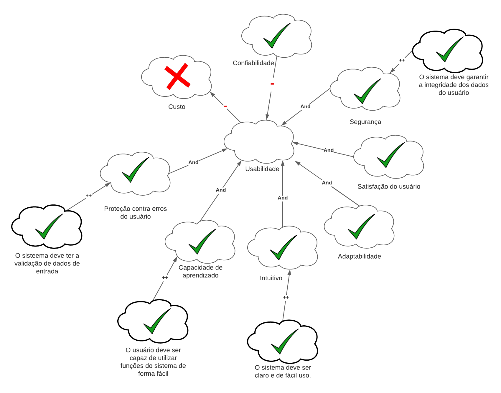

# NFR Framework

## Introdução

O NFR Framework é uma abordagem para analisar e representar Requisitos Não-Funcionais. Ele ajuda os desenvolvedores a implementar soluções personalizadas, levando em conta as características do sistema e do domínio em questão. Isso inclui Requisitos Não-Funcionais, Requisitos Funcionais, prioridades e carga de trabalho. Esses fatores influenciam a escolha de alternativas de desenvolvimento para um sistema específico (CHUNG et al., 2000).

O principal objetivo do framework é fornecer uma estrutura para armazenar o desenho e o raciocínio do processo de desenvolvimento de requisitos através de grafos chamados Softgoal Interdependency Graphs (SIGs). Eles armazenam as considerações do desenvolvedor sobre os requisitos e mostram a interdependência entre eles.

## Softgoals

- Softgoal NFR: São características abstratas que são postas a análises visando saber se a mesma será cumprida ou não, ou seja, será escolhida ou não para ser implementada. No fundo, são requisitos não funcionais categorizados em critérios/atributos de qualidade.
- Softgoal de Operacionalização: Representam as funcionalidades como uma forma concreta de viabilizar ou não as características abstratas.
- Softgoal de Afirmação: Aqui entram as características externas de cada softgoal, ou seja, são consideradas e refletidas na decisão, justificando a priorização do softgoal.

Como mostrado na Figura 1, assim se representará os Softgoals dentro do NFR Framework.

Figura 1 - Legenda de Softgoals.(Fonte: Autores. 2023).

## Contribuições

As contribuições são uma maneira de um softgoal de nível inferior ajudar a atingir um softgoal de nível superior. Elas podem ser positivas ou negativas e até mesmo satisfazer completamente o softgoal de nível superior.

Tipos de contribuições utilizadas pelo framework:

- AND: O ascendente é satisfeito se somente se todos os descendentes forem satisfeitos
- OR: O ascendente é satisfeito se um dos descendentes for satisfeito
- MAKE(++): O descendente com contribuição tão positiva a ponto de satisfazer o ascendente
- BREAK(--): O descendente com contribuição tão negativa a ponto de negar o ascendente
- HELP(+): O descendente com contribuição positiva parcial, que sozinho não satisfaz o ascendente
- HURT(-): O descendente com contribuição negativa parcial, que sozinha não chega a negar o ascendente
- UNKNOWN: O ascendente não afeta o pai
- EQUAL: Determina que o softgoal descendente só será satisfeito se o softgoal ascendente for satisfeito e que softgoal descendente será negado se o softgoal ascendente for negado.
- SOME(+/-): O descendente com contribuição (positiva ou negativa), onde a intensidade não se pode determinar

## Legenda

Utilizamos os tipos de rótulos utilizados pelos softgoals do framework, representadas na Figura 2, bem como as setas das contribuições na Figura 3. E os softgoals seguindo o padrão representado anteriormente na Figura 1.

Figura 2 - Legenda de Rótulos.(Fonte: Autores. 2023).

Figura 3 - Legenda de Setas de Contribuição.(Fonte: Autores. 2023).

## Metodologia

Para a implementação do Framework NFR, foram selecionados os requisitos não funcionais elicitados anteriormente com base em sua relevância para o sistema. Esses requisitos foram obtidos por meio do artefato de [Especificação Suplementar](../../modelagem/especificacaoSuplementar.md). Os Softgoal Interdependency Graphs (SIGs) foram construídos com base nos SIGs validados da dissertação de mestrado de Reinaldo Antônio da Silva [1].

Os requisitos não funcionais selecionados foram: confiabilidade, desempenho e usabilidade.

## Non-Functional-Requirements (NFR)

A seguir estão os Softgoal Interdependency Graphs (SIGs), as propagações de impactos e os cartões de especificação do NFR.

Os diagramas apresentados nas Figuras 2 a 7 foram elaborados com base nos diagramas apresentados na dissertação de mestrado intitulada "**NFR4ES**: Um Catálogo de Requisitos Não-Funcionais para Sistemas Embarcados" [1], escrita por Reinaldo Antônio da Silva.

### NFR01 - Confiabilidade

A Figura 4 apresenta o SIG de confiabilidade.

 Figura 4: SIG de confiabilidade (adaptado) 
Fonte: Adaptado de Figura 21 – Requisito de Confiabilidade - Refinamentos e Correlações por Reinaldo Antônio da Silva

#### Propagação de Impacto

A Figura 5 apresenta a propagação de impacto do NFR de confiabilidade.

 Figura 5: Propagação de impacto do NFR de confiabilidade (adaptado) 
Fonte: Adaptado de Figura 21 – Requisito de Confiabilidade - Refinamentos e Correlações por Reinaldo Antônio da Silva

#### Cartão de Especificação

| Cartão de Especificação | NFR Confiabilidade                                                                                                                                                                                                                                                                                                                                       |
| -------------------------- | -------------------------------------------------------------------------------------------------------------------------------------------------------------------------------------------------------------------------------------------------------------------------------------------------------------------------------------------------------- |
| Número do Requisito       | 01                                                                                                                                                                                                                                                                                                                                                       |
| Classificação            | Confiabilidade                                                                                                                                                                                                                                                                                                                                           |
| Descrição                | O sistema deve garantir que os dados sejam armazenados e recuperados de forma segura e consistente, sem perda ou corrupção.                                                                                                                                                                                                                            |
| Justificativa              | O sistema do wikipédia é uma fonte de informação amplamente utilizada por milhões de usuários em todo o mundo, que esperam encontrar conteúdo confiável e atualizado. Portanto, é essencial que o sistema garanta a confiabilidade dos dados, evitando perdas ou corrupções que possam afetar a qualidade e a credibilidade da informação. |
| Critério de aceitação   | O sistema deve passar por testes de carga, estresse e recuperação de falhas, comprovando que pode suportar altas demandas e situações adversas sem comprometer a integridade dos dado                                                                                                                                                                |
| Origem do requisito        | [Especificação Suplementar](../../../modelagem/especificacaoSuplementar/#3-confiabilidade)                                                                                                                                                                                                                                                                   |
| Prioridade                 | Alta                                                                                                                                                                                                                                                                                                                                                     |

 Tabela 1: Cartão de especificação do NFR de confiabilidade (Fonte: autores, 2023). 

### NFR02 - Desempenho

A Figura 6 apresenta o SIG de NFR de confiabilidade.

 Figura 6: SIG de desempenho (adaptado) 
Fonte: Adaptado de Figura 27 – Requisito de Desempenho - contribuições e correlações por Reinaldo Antônio da Silva

#### Propagação de Impacto

A Figura 7 apresenta a propagação de impacto do NFR de confiabilidade.

 Figura 7: Propagação de impacto do NFR de desempenho (adaptado) 
Fonte: Adaptado de Figura 27 – Requisito de Desempenho - contribuições e correlações por Reinaldo Antônio da Silva

#### Cartão de Especificação

| Cartão de Especificação | NFR Desempenho                                                                                                                                                                                                                                                                                                                                                                                                                                                                                     |
| -------------------------- | -------------------------------------------------------------------------------------------------------------------------------------------------------------------------------------------------------------------------------------------------------------------------------------------------------------------------------------------------------------------------------------------------------------------------------------------------------------------------------------------------- |
| Número do Requisito       | 02                                                                                                                                                                                                                                                                                                                                                                                                                                                                                                 |
| Classificação            | Desempenho                                                                                                                                                                                                                                                                                                                                                                                                                                                                                         |
| Descrição                | O sistema deve responder às solicitações dos usuários de forma rápida e eficiente, sem causar atrasos ou travamentos.                                                                                                                                                                                                                                                                                                                                                                         |
| Justificativa              | O sistema do wikipédia é acessado por milhões de usuários simultaneamente, que realizam consultas e edições nos artigos disponíveis. Além disso, o sistema possui um grande volume de dados armazenados, que devem ser processados e entregues aos usuários de forma eficaz. Portanto, é fundamental que o sistema tenha um bom desempenho, garantindo que os usuários tenham uma experiência satisfatória e não desistam de usar o serviço por causa de lentidão ou instabilidade |
| Critério de aceitação   | O sistema deve atender aos padrões de tempo de resposta e taxa de transferência definidos pelo cliente, medidos por ferramentas de monitoramento e avaliação de desempenho.                                                                                                                                                                                                                                                                                                                    |
| Origem do requisito        | [Especificação Suplementar](../../../modelagem/especificacaoSuplementar/)                                                                                                                                                                                                                                                                                                                                                                                                                              |
| Prioridade                 | Alta                                                                                                                                                                                                                                                                                                                                                                                                                                                                                               |

 Tabela 2: Cartão de especificação do NFR de desempenho (Fonte: autores, 2023). 

### NFR03 - Usabilidade

A Figura 8 apresenta o SIG de confiabilidade.

 Figura 8: SIG de Usabilidade (adaptado) 
Fonte: Adaptado de Figura 86 – Usabilidade - contribuições e operacionalizações por Reinaldo Antônio da Silva

#### Propagação de Impacto

A Figura 9 apresenta a propagação de impacto do NFR de confiabilidade.

 Figura 9: Propagação de impacto do NFR de desempenho (adaptado) 
Fonte: Adaptado de Figura 86 – Usabilidade - contribuições e operacionalizações por Reinaldo Antônio da Silva

#### Cartão de Especificação

| Cartão de Especificação | NFR Usabilidade                                                                                                                                                                                                                                                                                                                                                                                                                                                                                    |
| -------------------------- | -------------------------------------------------------------------------------------------------------------------------------------------------------------------------------------------------------------------------------------------------------------------------------------------------------------------------------------------------------------------------------------------------------------------------------------------------------------------------------------------------- |
| Número do Requisito       | 03                                                                                                                                                                                                                                                                                                                                                                                                                                                                                                 |
| Classificação            | Usabilidade                                                                                                                                                                                                                                                                                                                                                                                                                                                                                        |
| Descrição                | O sistema deve responder às solicitações dos usuários de forma rápida e eficiente, sem causar atrasos ou travamentos.                                                                                                                                                                                                                                                                                                                                                                         |
| Justificativa              | O sistema do wikipédia é acessado por milhões de usuários simultaneamente, que realizam consultas e edições nos artigos disponíveis. Além disso, o sistema possui um grande volume de dados armazenados, que devem ser processados e entregues aos usuários de forma eficaz. Portanto, é fundamental que o sistema tenha um bom desempenho, garantindo que os usuários tenham uma experiência satisfatória e não desistam de usar o serviço por causa de lentidão ou instabilidade |
| Critério de aceitação   | O sistema deve atender aos padrões de tempo de resposta e taxa de transferência definidos pelo cliente, medidos por ferramentas de monitoramento e avaliação de desempenho.                                                                                                                                                                                                                                                                                                                    |
| Origem do requisito        | [Especificação Suplementar](../../../modelagem/especificacaoSuplementar/#2-usabilidade)                                                                                                                                                                                                                                                                                                                                                                                                                |
| Prioridade                 | Alta                                                                                                                                                                                                                                                                                                                                                                                                                                                                                               |

 Tabela 2: Cartão de especificação do NFR de usabilidade (Fonte: autores, 2023). 

## Referência Bibliográfica

[1] Silva, Reinaldo Antônio da. **NFR4ES: um Catálogo de Requisitos Não-Funcionais para
Sistemas Embarcados**. [Dissertação de mestrado]. Universidade Federal de Pernambuco, Recife, 2019.

## Histórico de versão

| Versão |    Data    |      Descrição      |       Autor       | Revisor |
| :-----: | :--------: | :--------------------: | :---------------: | :------: |
|   1.0   | 23/05/2023 | Criação do documento | Henrique e Samuel | Chaydson |
