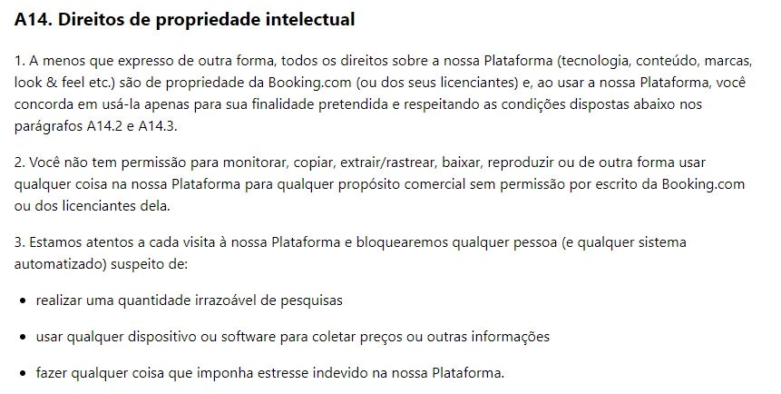

## Introdução

Bem-vindo à página do aplicativo selecionado para ser estudado na disciplina. Aqui serão apresentados os detalhes do aplicativo escolhido dentre a [lista de aplicativos](aplicativosAnalisados.md). O aplicativo escolhido para este projeto é o Booking, uma plataforma popular que oferece uma ampla gama de opções de hospedagem e serviços relacionados a viajantes de todo o mundo.

## Sobre o aplicativo

O [Booking](https://www.booking.com/apps.pt-br.html) oferece diversas opções de hospedagem, desde hotéis, apartamentos, resorts e pousadas, até aluguéis de carros e pacotes de viagem completos. Ele pode ser encontrado tanto na Play Store quanto na App Store. Para saber mais detalhes consulte a [lista de aplicativos](aplicativosAnalisados.md).

## Por que foi escolhido o Booking?

O aplicativo Booking foi escolhido para o projeto na disciplina de Requisitos de Software devido à sua grande popularidade e ampla utilização em todo o mundo, além de fácil acesso aos seus usuários. Com uma ampla gama de acomodações disponíveis em diferentes países e cidades, ele oferece uma variedade de funcionalidades e recursos, incluindo pesquisa e reserva de acomodações, gerenciamento de reservas, suporte ao cliente e muito mais. Estudar os requisitos de um aplicativo tão complexo oferece uma oportunidade valiosa para aprender técnicas de elicitação e análise de requisitos. Portanto, o Booking pode ser um desafio significativo e uma oportunidade de aplicar conceitos e metodologias aprendidos na disciplina de Requisitos de Software.

## Imagens do aplicativo

Na Figura 1, podemos ver algumas imagens demonstrando algumas funcionalidades do aplicativo booking.

 Figura 1: Imagens do aplicativo (Fonte: Booking.com, 2023). 

## Direito de Uso ou Propriedade Intelectual

O aplicativo do Booking.com possui uma política de uso, que pode ser encontrada em seus termos no site. De acordo com os itens A14.2 e A14.3, as únicas restrições quanto ao uso da plataforma referem-se à proibição do uso comercial sem autorização expressa assinada por pessoas licenciadas ou pelo próprio Booking.com. Nosso objetivo é apenas de aprendizado, deixando claro que o projeto não tem nenhum objetivo comercial. Na Figura 2, é possível visualizar a imagem dos termos encontrados. O link para o site com esses termos pode ser encontrado nas referências bibliográficas.

 Figura 2: Direito de Propriedade Intelectual (Fonte: Booking.com, 2023). 

## Bibliografia

BOOKING.COM. Booking.com: Hotéis e Viagens. Disponível em: https://apps.apple.com/us/app/booking-com-hotels-travel/id367003839. Acesso em: 11 abr. 2023.

Booking.com. Termos e Condições. Disponível em: https://www.booking.com/content/terms.pt-br.html.Acesso em 20 abr. 2023.

## Histórico de Versão

| Versão | Data       | Descrição                         | Autor(es) | Revisor(es)    |
| ------- | ---------- | ----------------------------------- | --------- | -------------- |
| 1.0     | 11/05/2023 | Criação do documento              | Samuel    | Lucas Lopes    |
| 1.1     | 20/04/2023 | Atualização da Escolha            | Gabriel   | Lucas          |
| 1.2     | 20/04/2023 | Adicionando legendas nas imagens    | Lucas     | Henrique       |
| 1.3     | 23/04/2023 | Adicionando descrição para imagem | Henrique  | Lucas          |
| 1.4     | 04/07/2023 | Realizando correções              | Samuel    | Pedro Henrique |
