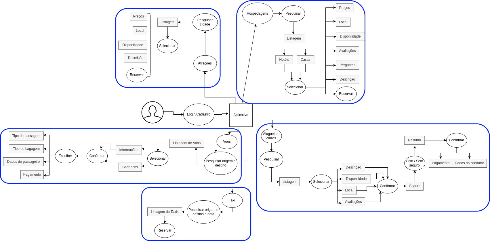

# Introdução

Seja bem-vindo à página de aplicativos analisados! Aqui, você encontrará uma lista completa de aplicativos avaliados pelo nosso grupo, juntamente com descrições detalhadas de cada um deles, bem como ilustrações na forma de rich picture para ajudar na visualização e compreensão. Um rich picture é uma maneira de explorar, reconhecer e definir uma situação e expressá-la através de diagramas para criar um modelo mental preliminar e pode ajudar a abrir discussão e chegar a um entendimento amplo e compartilhado de uma situação. Este método foi originalmente desenvolvido como parte da Metodologia de Sistemas Suaves (SSM) de Peter Checkland (2008).

## Booking

### Descrição do aplicativo

O Booking é um aplicativo de reserva de acomodações e viagens disponível para iOS e Android. Com uma interface fácil de usar, os usuários podem pesquisar e reservar hotéis, resorts, apartamentos, casas de temporada, albergues e outros tipos de acomodações em todo o mundo. Além disso, o aplicativo oferece a opção de reservar voos, aluguéis de carros e atividades turísticas. O Booking fornece avaliações de clientes e fotos dos alojamentos para ajudar os usuários a tomarem decisões informadas sobre onde ficar.

### Rich Picture:

A Figura 1 apresenta o Rich Picture elaborado para análise do aplicativo Booking.

Autor: Lucas Lopes

 Figura 1: Rich Picture do aplicativo Booking (Fonte: Lucas, 2023). 

## Cadastro Único

### Descrição do aplicativo

O Cadastro Único (CadÚnico) é um aplicativo criado pelo Governo Federal do Brasil com o objetivo de reunir informações de famílias de baixa renda e em situação de vulnerabilidade social, para que possam ter acesso a programas sociais do governo, como o Bolsa Família, por exemplo. O aplicativo permite que as famílias se cadastrem ou atualizem seus dados, informando informações pessoais, renda, moradia, escolaridade e outras informações relevantes. Além disso, o CadÚnico também é utilizado pelos governos estaduais e municipais para identificar as demandas da população mais carente e direcionar recursos e políticas públicas de forma mais eficiente. O aplicativo é uma importante ferramenta de inclusão social e combate à pobreza no Brasil.

### Rich Picture:

A Figura 2 apresenta o Rich Picture elaborado para análise do aplicativo Cadastro Único.

Autor: Gabriel Ferreira

 Figura 2: Rich Picture do aplicativo Cadastro Único (Fonte: Gabriel, 2023). 

## Calendário Menstrual

### Descrição do aplicativo

O aplicativo "Calendário Menstrual - Period Tracker" é uma ferramenta para acompanhar o ciclo menstrual das mulheres. Ele permite que as usuárias registrem e monitorem o início e o fim do período menstrual, o período fértil e o momento da ovulação, bem como sintomas como dores, humor e peso. Além disso, o aplicativo oferece previsões para os próximos ciclos menstruais com base nas informações fornecidas pelas usuárias, permitindo que elas se planejem para eventos importantes ou consultas médicas. A interface é intuitiva e fácil de usar, com gráficos e tabelas que mostram o histórico menstrual e a evolução dos sintomas ao longo do tempo.

### Rich Picture:

A Figura 3 apresenta o Rich Picture elaborado para análise do aplicativo Calendário Menstrual.

Autor: Chaydson Ferreira

 Figura 3: Rich Picture do aplicativo Calendario menstrual (Fonte: Chaydson, 2023). 

## Dívida Aberta

### Descrição do aplicativo

O Dívida Aberta é um aplicativo gratuito que permite aos usuários gerenciar suas dívidas de forma fácil e eficiente. Através dele, é possível acompanhar as dívidas em aberto, negociar descontos e até mesmo quitar as dívidas pelo celular. O aplicativo conecta os usuários com empresas que desejam negociar as dívidas, proporcionando um processo mais rápido e conveniente. Além disso, o Dívida Aberta oferece ferramentas para ajudar os usuários a organizar suas dívidas, criar um planejamento financeiro e monitorar seus gastos, visando uma vida financeira mais saudável e equilibrada.

### Rich Picture:

A Figura 4 apresenta o Rich Picture elaborado para análise do aplicativo Dívida Aberta.

Autor: Henrique Pucci

 Figura 4: Rich Picture do aplicativo Divida Aberta (Fonte: Henrique, 2023). 

## Localiza

### Descrição do aplicativo

O Localiza é um aplicativo que permite alugar carros de forma simples e rápida. Disponível para smartphones Android e iOS, o aplicativo oferece diversas opções de veículos, desde compactos até utilitários esportivos, além de contar com um sistema de geolocalização que ajuda o usuário a encontrar a loja mais próxima. Além disso, o aplicativo permite realizar todo o processo de locação, desde a escolha do veículo até o pagamento, de forma online e sem burocracias, tornando a experiência do usuário muito mais prática e conveniente.

### Rich Picture:

A Figura 5 apresenta o Rich Picture elaborado para análise do aplicativo Localiza.

Autor: Samuel Gomes

 Figura 5: Rich Picture do aplicativo Localiza (Fonte: Samuel, 2023). 

## Pinterest

### Descrição do aplicativo

O Pinterest é um aplicativo de rede social e plataforma de compartilhamento de imagens que permite aos usuários criar quadros personalizados para organizar e salvar imagens e vídeos de interesse. Com uma função de pesquisa poderosa e um feed personalizado, os usuários podem descobrir e compartilhar inspirações sobre diversos tópicos, desde moda até gastronomia. O aplicativo também oferece recursos adicionais, como compras e publicidade, tornando-o uma plataforma abrangente para inspiração, descoberta e marketing.

### Rich Picture:

A Figura 6 apresenta o Rich Picture elaborado para análise do aplicativo Pinterest.

Autor: Pedro Henrique

 Figura 6: Rich Picture do aplicativo Pinterest (Fonte: Pedro, 2023). 

## Bibliografia

BARROS, André. Rich Picture. Disponível em: [https://www.youtube.com/watch?v=NxEPxW_Ku8M&ab_channel=Andr%C3%A9Barro
sdeSales](https://www.youtube.com/watch?v=NxEPxW_Ku8M&ab_channel=Andr%C3%A9Barro
sdeSales). Acesso em: 11 abr.. 2023.

BOOKING.COM B.V. Booking.com: Hotéis, casas e muito mais. Disponível em: [https://play.google.com/store/apps/details?id=com.booking&amp;hl=pt_BR&amp;gl=US](https://play.google.com/store/apps/details?id=com.booking&hl=pt_BR&gl=US). Acesso em: 11 abr. 2023.

DATAPREV. Meu CadÚnico. Disponível em: [https://play.google.com/store/apps/details?id=br.gov.dataprev.meucadunico&amp;hl=pt_BR&amp;gl=US](https://play.google.com/store/apps/details?id=br.gov.dataprev.meucadunico&hl=pt_BR&gl=US). Acesso em: 11 abr. 2023.

GOVERNO DO BRASIL. Cadastro Único. Disponível em: [https://apps.apple.com/br/app/cadastro-%C3%BAnico/id1605659516](https://apps.apple.com/br/app/cadastro-%C3%BAnico/id1605659516). Acesso em: 11 abr. 2023.

POPULAR APPS. Calendário Menstrual - Calendário do ciclo menstrual. Disponível em: [https://play.google.com/store/apps/details?id=com.popularapp.periodcalendar&amp;hl=pt_BR&amp;gl=US](https://play.google.com/store/apps/details?id=com.popularapp.periodcalendar&hl=pt_BR&gl=US). Acesso em: 11 abr. 2023.

PROCURADORIA-GERAL DA FAZENDA NACIONAL (PGFN). Dívida Aberta - PGFN. Disponível em: [https://play.google.com/store/apps/details?id=br.gov.serpro.pgfn.devedores&amp;hl=pt_BR&amp;gl=US](https://play.google.com/store/apps/details?id=br.gov.serpro.pgfn.devedores&hl=pt_BR&gl=US). Acesso em: 11 abr. 2023.

LOCALIZA HERTZ S.A. Localiza Hertz - Aluguel de carros e venda de seminovos. Disponível em: [https://play.google.com/store/apps/details?id=com.localiza.mobile&amp;hl=pt_BR&amp;gl=US](https://play.google.com/store/apps/details?id=com.localiza.mobile&hl=pt_BR&gl=US). Acesso em: 11 abr. 2023.

PINTEREST, INC. Pinterest - Ideias criativas para todos os projetos da vida. Disponível em: [https://play.google.com/store/apps/details?id=com.pinterest&amp;hl=pt_BR&amp;gl=US](https://play.google.com/store/apps/details?id=com.pinterest&hl=pt_BR&gl=US). Acesso em: 11 abr. 2023.

Better Evaluation. Rich pictures. Better Evaluation. Disponível em: [https://www.betterevaluation.org/methods-approaches/methods/rich-pictures](https://www.betterevaluation.org/methods-approaches/methods/rich-pictures). Acesso em: 11 abr. 2023

## Histórico de Versão

| Versão | Data       | Descrição                          | Autor(es) | Revisor(es)                                        |
| ------- | ---------- | ------------------------------------ | --------- | -------------------------------------------------- |
| 1.0     | 11/05/2023 | Criação do documento               | Samuel    | Chaydson, Lucas, Gabriel, Samuel, Henrique e Pedro |
| 1.1     | 20/04/2023 | Adicionando legendas nas imagems     | Lucas     | Henrique                                           |
| 1.2     | 24/04/2023 | Padronizando referências            | Samuel    | Pedro                                              |
| 1.3     | 24/04/2023 | Adicionando descrição para imagens | Henrique  | Lucas                                              |
| 1.4     | 05/07/2023 | Realizando correções               | Samuel    | Pedro                                              |
