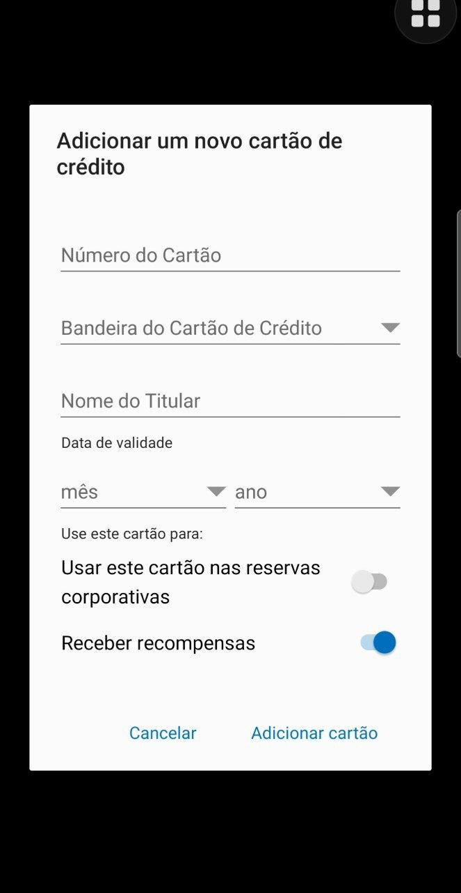
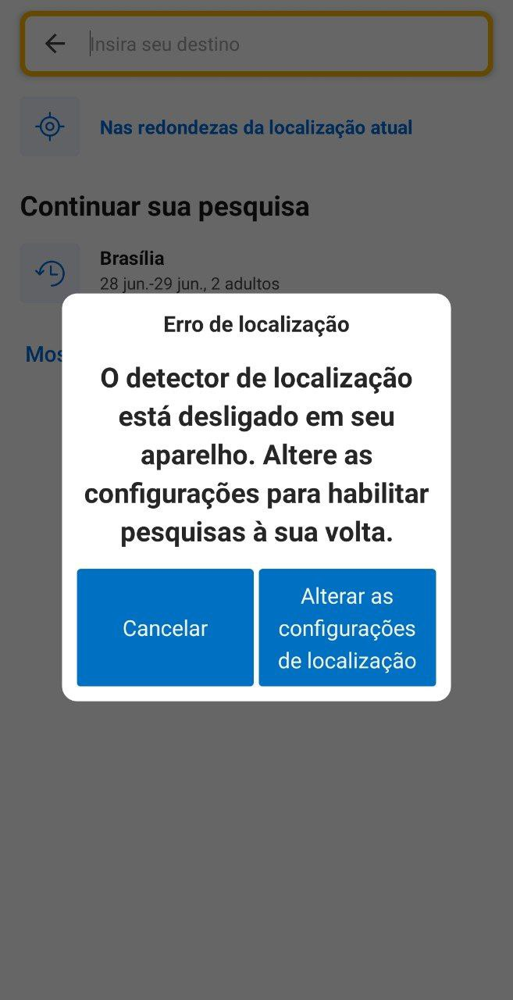
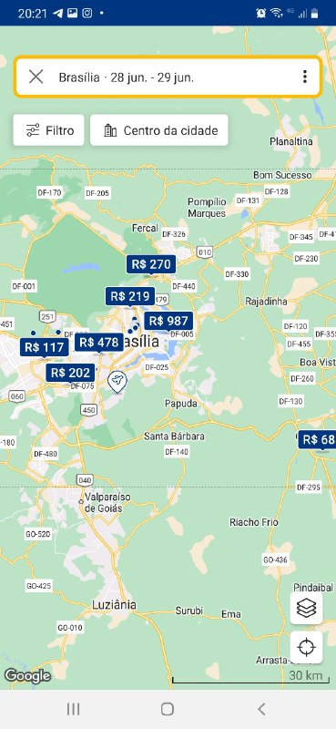
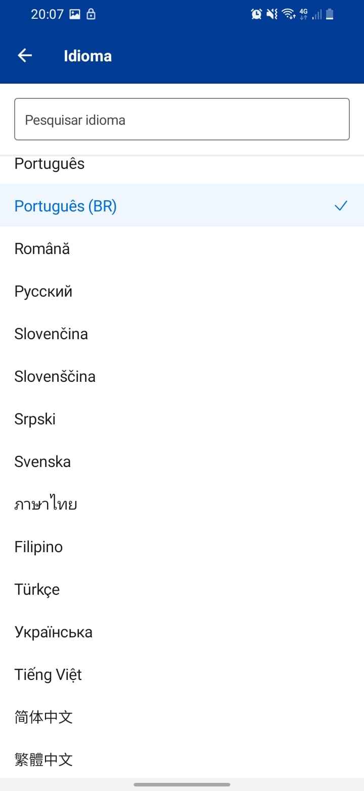
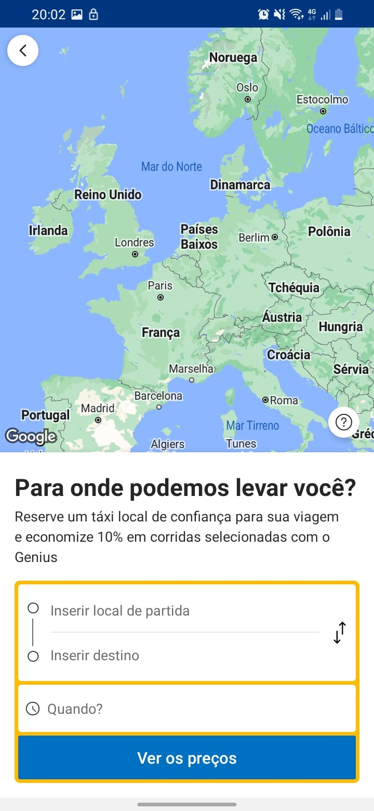

## Introdução

Este artefato tem como objetivo registrar a pós-rastreabilidade dos artefatos e requisitos do projeto, utilizando a metodologia "Forward-from", na qual liga os requisitos gerados por meio da elicitação de requisitos, aos seus artefatos feitos durante o andamento do projeto e da disciplina.

## Metodologia

A partir dos requisitos padronizados dentro do Backlog, foi feita a rastreablidade dos mesmos, foi utilizado o meta-modelo fornecido por Toranzo [1]. Toranzo descreve que o meta-modelo precisa ser alguns dos seguintes:

- Ambiental: informações oriundas do contexto no qual a organização está inserida;
- Organizacional: informações pertencentes à organização (missão, objetivos e estratégias);
- Gerencial: informações que auxiliam a gerência do projeto;
- Desenvolvimento: informações associadas aos diversos artefatos gerados ao longo do processo de desenvolvimento (artefatos de requisitos, diagramas, códigos, casos de teste e outros).

Portanto, todos as tabelas foram feitas com o meta-modelo de Desenvolvimento, pois o objetivo é rastrear os artefatos gerados ao longo do processo de desenvolvimento.

Além disso, o meta-modelo de Desenvolvimento deve possuir os seguintes elementos:

- Satisfação: classe origem tem dependência de satisfação com a classe destino.
- Recurso: classe origem tem dependência de recurso com a classe destino.
- Responsabilidade: registra a participação, responsabilidade e ação de pessoas sobre artefatos.
- Representação: captura a representação ou modelagem dos requisitos em outras linguagens.
- Alocado: classe origem está relacionada à classe destino, que representa um subsistema.
- Agregação: indica “composição” de elementos.

Os autores decidiram retirar "Responsabilidade" e "Alocado", pois foi entendido que eles não eram atendidos, dado que essa disciplina não contempla o desenvolvimento do aplicativo.

A Tabela 1 mostra o modelo padrão que será utilizado nesse artefato como padronização do processo.

| Artefato      | Desenvolvimento |
| ------------- | --------------- |
| Elos          | Relacionamentos |
| Satisfação    | -               |
| Recurso       | -               |
| Representação | -               |
| Agregação     | -               |

 Tabela 1: Tabela padrão para o forward from. (Fonte: Lucas e Samuel, 2023). 

## RF01

O aplicativo deve permitir que os usuários se registrem fornecendo informações básicas, como nome, sobrenome, endereço de e-mail e senha.

| [RF06](../modelagem/modelo-agil/backlog.md) | Desenvolvimento                                                                                                                                                                                                                                                                                                                                                                          |
| ------------------------------------------- | ---------------------------------------------------------------------------------------------------------------------------------------------------------------------------------------------------------------------------------------------------------------------------------------------------------------------------------------------------------------------------------------- |
| Elos                                        | Relacionamentos                                                                                                                                                                                                                                                                                                                                                                          |
| Satisfação                                  | [Especificação suplementar SUPT02](../modelagem/especificacaoSuplementar.md) [Especificação suplementar CONF03](../modelagem/especificacaoSuplementar.md) [NRF Usabilidade](../modelagem/modelo-agil/nfrFramework.md)                                                                                                                                                          |
| Recurso                                     | [Lexico 09](../modelagem/lexicos.md) [Caso de uso 01](../modelagem/casosDeUso.md)                                                                                                                                                                                                                                                                                                   |
| Representação                               | [Épico 10](../modelagem/modelo-agil/backlog.md) [Cenário 02](../modelagem/cenarios.md) {: style="height:600px;display: block; margin: auto;"} {: style="height:600px;display: block; margin: auto;"} {: style="height:600px;display: block; margin: auto;"} |
| Agregação                                   | [FST01](../elicitacao/storytelling.md) e [FOBS01](../elicitacao/observacao.md)                                                                                                                                                                                                                                                                                                           |

 Tabela 2: Tabela forward from para o requisito funcional 03. (Fonte: Lucas e Samuel, 2023). 

## RF02

O aplicativo deve permitir que os usuários pesquisem acomodações com base em critérios específicos, como localização, datas de check-in e check-out, tipo de quarto e preço.

| [RF06](../modelagem/modelo-agil/backlog.md) | Desenvolvimento                                                                                                                                                                                                                 |
| ------------------------------------------- | ------------------------------------------------------------------------------------------------------------------------------------------------------------------------------------------------------------------------------- |
| Elos                                        | Relacionamentos                                                                                                                                                                                                                 |
| Satisfação                                  | [Especificação suplementar USAB06](../modelagem/especificacaoSuplementar.md) [Especificação suplementar PERF02](../modelagem/especificacaoSuplementar.md) [NRF Usabilidade](../modelagem/modelo-agil/nfrFramework.md) |
| Recurso                                     | [Lexico 09](../modelagem/lexicos.md) [Caso de uso 02](../modelagem/casosDeUso.md)                                                                                                                                          |
| Representação                               | [Historia de Usuário 09](../modelagem/modelo-agil/historiasDeUsuario.md) [Épico 01](../modelagem/modelo-agil/backlog.md) {: style="height:600px;display: block; margin: auto;"}      |
| Agregação                                   | [FST02](../elicitacao/storytelling.md)                                                                                                                                                                                          |

 Tabela 3: Tabela forward from para o requisito funcional 03. (Fonte: Lucas e Samuel, 2023). 

## RF03

O aplicativo deve permitir que os usuários reservem acomodações selecionadas, inserindo as informações de pagamento e confirmando a reserva.

| [RF03](../modelagem/modelo-agil/backlog.md) | Desenvolvimento                                                                                                                                                                                                                 |
| ------------------------------------------- | ------------------------------------------------------------------------------------------------------------------------------------------------------------------------------------------------------------------------------- |
| Elos                                        | Relacionamentos                                                                                                                                                                                                                 |
| Satisfação                                  | [Especificação suplementar PERF01](../modelagem/especificacaoSuplementar.md) [Especificação suplementar USAB01](../modelagem/especificacaoSuplementar.md) [NRF Usabilidade](../modelagem/modelo-agil/nfrFramework.md) |
| Recurso                                     | [Caso de uso 03](../modelagem/casosDeUso.md) [Lexico 15](../modelagem/lexicos.md)                                                                                                                                          |
| Representação                               | [Historia de Usuário 34](../modelagem/modelo-agil/historiasDeUsuario.md) [Épico 01](../modelagem/modelo-agil/backlog.md) [Cenário 03](../modelagem/cenarios.md)                                                       |
| Agregação                                   | [FST03](../elicitacao/storytelling.md), [FB03](../elicitacao/brainstorm.md) e [FOBS06](../elicitacao/observacao.md)                                                                                                             |

 Tabela 4: Tabela forward from para o requisito funcional 03. (Fonte: Lucas e Samuel, 2023). 

## RF04

O aplicativo deve permitir que os usuários cancelem suas reservas de acomodação, desde que sejam feitas dentro dos termos e condições estabelecidos pela empresa.

| [RF04](../modelagem/modelo-agil/backlog.md) | Desenvolvimento                                                                                                                                                                                                                                                                                                             |
| ------------------------------------------- | --------------------------------------------------------------------------------------------------------------------------------------------------------------------------------------------------------------------------------------------------------------------------------------------------------------------------- |
| Elos                                        | Relacionamentos                                                                                                                                                                                                                                                                                                             |
| Satisfação                                  | [Especificação suplementar USAB01](../modelagem/especificacaoSuplementar.md) [NRF Usabilidade](../modelagem/modelo-agil/nfrFramework.md)                                                                                                                                                                               |
| Recurso                                     | [Lexico 10](../modelagem/lexicos.md)                                                                                                                                                                                                                                                                                        |
| Representação                               | [Historia de Usuário 24](../modelagem/modelo-agil/historiasDeUsuario.md) [Épico 01](../modelagem/modelo-agil/backlog.md) {: style="height:600px;display: block; margin: auto;"} {: style="height:600px;display: block; margin: auto;"} |
| Agregação                                   | [FST04](../elicitacao/storytelling.md) e [FB04](../elicitacao/brainstorm.md)                                                                                                                                                                                                                                                |

 Tabela 5: Tabela forward from para o requisito funcional 03. (Fonte: Lucas e Samuel, 2023). 

## RF05

O aplicativo deve permitir que os usuários pesquisem voos com base em critérios específicos, como origem, destino, datas e número de passageiros.

| [RF05](../modelagem/modelo-agil/backlog.md) | Desenvolvimento                                                                                                                                                                                                                 |
| ------------------------------------------- | ------------------------------------------------------------------------------------------------------------------------------------------------------------------------------------------------------------------------------- |
| Elos                                        | Relacionamentos                                                                                                                                                                                                                 |
| Satisfação                                  | [Especificação suplementar USAB02](../modelagem/especificacaoSuplementar.md) [Especificação suplementar USAB04](../modelagem/especificacaoSuplementar.md) [NRF Usabilidade](../modelagem/modelo-agil/nfrFramework.md) |
| Recurso                                     | [Caso de uso 02](../modelagem/casosDeUso.md) [Lexico 09](../modelagem/lexicos.md)                                                                                                                                          |
| Representação                               | [Épico 02](../modelagem/modelo-agil/backlog.md) [História de usuário 09](../modelagem/modelo-agil/historiasDeUsuario.md) {: style="height:600px;display: block; margin: auto;"}      |
| Agregação                                   | [FST05](../elicitacao/storytelling.md)                                                                                                                                                                                          |

 Tabela 6: Tabela forward from para o requisito funcional 03. (Fonte: Lucas e Samuel, 2023). 

## RF06

O aplicativo deve permitir que os usuários reservem voos selecionados, inserindo as informações de pagamento e confirmando a reserva.

| [RF06](../modelagem/modelo-agil/backlog.md) | Desenvolvimento                                                                                                                                                                                                                 |
| ------------------------------------------- | ------------------------------------------------------------------------------------------------------------------------------------------------------------------------------------------------------------------------------- |
| Elos                                        | Relacionamentos                                                                                                                                                                                                                 |
| Satisfação                                  | [Especificação suplementar USAB06](../modelagem/especificacaoSuplementar.md) [Especificação suplementar PERF02](../modelagem/especificacaoSuplementar.md) [NRF Usabilidade](../modelagem/modelo-agil/nfrFramework.md) |
| Recurso                                     | [Lexico 15](../modelagem/lexicos.md) [Caso de uso 06](../modelagem/casosDeUso.md)                                                                                                                                          |
| Representação                               | [Historia de Usuário 26](../modelagem/modelo-agil/historiasDeUsuario.md) [Épico 02](../modelagem/modelo-agil/backlog.md) [Cenário 02](../modelagem/cenarios.md)                                                       |
| Agregação                                   | [FST06](../elicitacao/storytelling.md) e [FOBS07](../elicitacao/observacao.md)                                                                                                                                                  |

 Tabela 7: Tabela forward from para o requisito funcional 03. (Fonte: Lucas e Samuel, 2023). 

## RF07

O aplicativo deve permitir que os usuários gerenciem suas reservas existentes, incluindo a visualização de detalhes da reserva, alterações de datas e cancelamentos.

| [RF07](../modelagem/modelo-agil/backlog.md) | Desenvolvimento                                                                                                                                                                                                                    |
| ------------------------------------------- | ---------------------------------------------------------------------------------------------------------------------------------------------------------------------------------------------------------------------------------- |
| Elos                                        | Relacionamentos                                                                                                                                                                                                                    |
| Satisfação                                  | [Especificação suplementar USAB03](../modelagem/especificacaoSuplementar.md) [Especificação suplementar CONF04](../modelagem/especificacaoSuplementar.md) [NRF Confiabilidade](../modelagem/modelo-agil/nfrFramework.md) |
| Recurso                                     | [Lexico 09](../modelagem/lexicos.md)                                                                                                                                                                                               |
| Representação                               | [Historia de Usuário 27](../modelagem/modelo-agil/historiasDeUsuario.md) [Épico 01](../modelagem/modelo-agil/backlog.md) {: style="height:600px;display: block; margin: auto;"}         |
| Agregação                                   | [FST08](../elicitacao/storytelling.md)                                                                                                                                                                                             |

 Tabela 8: Tabela forward from para o requisito funcional 03. (Fonte: Lucas e Samuel, 2023). 

## RF08

O aplicativo deve permitir que os usuários visualizem seu histórico de reservas anteriores, incluindo informações como datas, acomodações e voos reservados.

| [RF08](../modelagem/modelo-agil/backlog.md) | Desenvolvimento                                                                                                                                                                                                                    |
| ------------------------------------------- | ---------------------------------------------------------------------------------------------------------------------------------------------------------------------------------------------------------------------------------- |
| Elos                                        | Relacionamentos                                                                                                                                                                                                                    |
| Satisfação                                  | [Especificação suplementar USAB03](../modelagem/especificacaoSuplementar.md) [Especificação suplementar CONF04](../modelagem/especificacaoSuplementar.md) [NRF Confiabilidade](../modelagem/modelo-agil/nfrFramework.md) |
| Recurso                                     | [Lexico 09](../modelagem/lexicos.md)                                                                                                                                                                                               |
| Representação                               | [Historia de Usuário 27](../modelagem/modelo-agil/historiasDeUsuario.md) [Épico 01](../modelagem/modelo-agil/backlog.md) {: style="height:600px;display: block; margin: auto;"}         |
| Agregação                                   | [FST10](../elicitacao/storytelling.md), [FB05](../elicitacao/brainstorm.md) , [FB06](../elicitacao/brainstorm.md) e [FOBS13](../elicitacao/observacao.md)                                                                          |

 Tabela 9: Tabela forward from para o requisito funcional 03. (Fonte: Lucas e Samuel, 2023). 

## RF09

O sistema deve possuir escolha do método de pagamento

| [RF09](../modelagem/modelo-agil/backlog.md) | Desenvolvimento                                                                                                                                                                                                            |
| ------------------------------------------- | -------------------------------------------------------------------------------------------------------------------------------------------------------------------------------------------------------------------------- |
| Elos                                        | Relacionamentos                                                                                                                                                                                                            |
| Satisfação                                  | [Especificação suplementar 4](../modelagem/especificacaoSuplementar.md) [Especificação suplementar 2](../modelagem/especificacaoSuplementar.md) [NRF Usabilidade](../modelagem/modelo-agil/nfrFramework.md)      |
| Recurso                                     | [Caso de uso 04](../modelagem/casosDeUso.md) [Lexico 11](../modelagem/lexicos.md)                                                                                                                                     |
| Representação                               | [Historia de Usuário 29](../modelagem/modelo-agil/historiasDeUsuario.md) [Épico 07](../modelagem/modelo-agil/backlog.md) {: style="height:600px;display: block; margin: auto;"} |
| Agregação                                   | [FB02](../elicitacao/brainstorm.md)                                                                                                                                                                                        |

 Tabela 10: Tabela forward from para o requisito funcional 03. (Fonte: Lucas e Samuel, 2023). 

## RF10

Permitir que um grupo de pessoas reservem um local.

| [RF10](../modelagem/modelo-agil/backlog.md) | Desenvolvimento                                                                                                                                                                                                                                                        |
| ------------------------------------------- | ---------------------------------------------------------------------------------------------------------------------------------------------------------------------------------------------------------------------------------------------------------------------- |
| Elos                                        | Relacionamentos                                                                                                                                                                                                                                                        |
| Satisfação                                  | [Especificação suplementar USAB01](../modelagem/especificacaoSuplementar.md) [Especificação suplementar SUPT01](../modelagem/especificacaoSuplementar.md) [NRF Usabilidade](../modelagem/modelo-agil/nfrFramework.md)                                        |
| Recurso                                     | [Caso de uso 03](../modelagem/casosDeUso.md) [Lexico 15](../modelagem/lexicos.md)                                                                                                                                                                                 |
| Representação                               | [Historia de Usuário 34](../modelagem/modelo-agil/historiasDeUsuario.md) [Épico 01](../modelagem/modelo-agil/backlog.md) [Cenário 03](../modelagem/cenarios.md) {: style="height:600px;display: block; margin: auto;"} |
| Agregação                                   | [FB07](../elicitacao/brainstorm.md)                                                                                                                                                                                                                                    |

 Tabela 11: Tabela forward from para o requisito funcional 03. (Fonte: Lucas e Samuel, 2023). 

## RF11

Sincronizar as datas das reservas com o calendário do usuário.

| [RF11](../modelagem/modelo-agil/backlog.md) | Desenvolvimento                                                                                                                                                                                                                 |
| ------------------------------------------- | ------------------------------------------------------------------------------------------------------------------------------------------------------------------------------------------------------------------------------- |
| Elos                                        | Relacionamentos                                                                                                                                                                                                                 |
| Satisfação                                  | [Especificação suplementar SUPT02](../modelagem/especificacaoSuplementar.md) [Especificação suplementar IMPL01](../modelagem/especificacaoSuplementar.md) [NRF Usabilidade](../modelagem/modelo-agil/nfrFramework.md) |
| Recurso                                     | -                                                                                                                                                                                                                               |
| Representação                               | -                                                                                                                                                                                                                               |
| Agregação                                   | [FB09](../elicitacao/brainstorm.md)                                                                                                                                                                                             |

 Tabela 12: Tabela forward from para o requisito funcional 03. (Fonte: Lucas e Samuel, 2023). 

## RF12

Permitir visualização de imagens do local pelo usuário.

| [RF12](../modelagem/modelo-agil/backlog.md) | Desenvolvimento                                                                                                                                                                                                                                                                                                              |
| ------------------------------------------- | ---------------------------------------------------------------------------------------------------------------------------------------------------------------------------------------------------------------------------------------------------------------------------------------------------------------------------- |
| Elos                                        | Relacionamentos                                                                                                                                                                                                                                                                                                              |
| Satisfação                                  | [Especificação suplementar USAB03](../modelagem/especificacaoSuplementar.md) [Especificação suplementar CONF04](../modelagem/especificacaoSuplementar.md) [Especificação suplementar PERF01](../modelagem/especificacaoSuplementar.md) [NRF Usabilidade](../modelagem/modelo-agil/nfrFramework.md)            |
| Recurso                                     | [Cenário 04](../modelagem/cenarios.md) [Cenário 03](../modelagem/cenarios.md) [Léxico 09](../modelagem/lexicos.md)                                                                                                                                                                                                 |
| Representação                               | [Prototipo de alta fidelidade](https://www.figma.com/proto/sbDRhmJewJH9SkgieA0DfK/HFP---Booking.com?type=design&node-id=19-12&t=lJIYMtNgoOVPdk0d-1&scaling=scale-down&page-id=0%3A1&starting-point-node-id=19%3A12&mode=design) {: style="height:600px;display: block; margin: auto;"} |
| Agregação                                   | [FB12](../elicitacao/brainstorm.md)                                                                                                                                                                                                                                                                                          |

 Tabela 13: Tabela forward from para o requisito funcional 03. (Fonte: Lucas e Samuel, 2023). 

## RF13

Permitir visualização de imagens do carro pelo usuário.

| [RF13](../modelagem/modelo-agil/backlog.md) | Desenvolvimento                                                                                                                                                                                                                                                                                                     |
| ------------------------------------------- | ------------------------------------------------------------------------------------------------------------------------------------------------------------------------------------------------------------------------------------------------------------------------------------------------------------------- |
| Elos                                        | Relacionamentos                                                                                                                                                                                                                                                                                                     |
| Satisfação                                  | [Especificação suplementar USAB03](../modelagem/especificacaoSuplementar.md) [Especificação suplementar CONF04](../modelagem/especificacaoSuplementar.md)  [Especificação suplementar PERF01](../modelagem/especificacaoSuplementar.md)  [NRF Usabilidade](../modelagem/modelo-agil/nfrFramework.md) |
| Recurso                                     | [Cenário 05](../modelagem/cenarios.md) [Lexico 09](../modelagem/lexicos.md) [Épico 09](../modelagem/modelo-agil/backlog.md)                                                                                                                                                                               |
| Representação                               | {: style="height:600px;display: block; margin: auto;"}                                                                                                                                                                                                                        |
| Agregação                                   | [FB13](../elicitacao/brainstorm.md)                                                                                                                                                                                                                                                                                 |

 Tabela 14: Tabela forward from para o requisito funcional 03. (Fonte: Lucas e Samuel, 2023). 

## RF14

O sistema deve ser capaz de localizar o usuário se permitido.

| [RF14](../modelagem/modelo-agil/backlog.md) | Desenvolvimento                                                                                                                                                                                                                    |
| ------------------------------------------- | ---------------------------------------------------------------------------------------------------------------------------------------------------------------------------------------------------------------------------------- |
| Elos                                        | Relacionamentos                                                                                                                                                                                                                    |
| Satisfação                                  | [Especificação suplementar USAB03](../modelagem/especificacaoSuplementar.md) [Especificação suplementar CONF03](../modelagem/especificacaoSuplementar.md) [NRF Confiabilidade](../modelagem/modelo-agil/nfrFramework.md) |
| Recurso                                     | [Lexico 12](../modelagem/lexicos.md)                                                                                                                                                                                               |
| Representação                               | [Épico 11](../modelagem/modelo-agil/backlog.md) {: style="height:600px;display: block; margin: auto;"}                                                                                       |
| Agregação                                   | [FB22](../elicitacao/brainstorm.md)                                                                                                                                                                                                |

 Tabela 15: Tabela forward from para o requisito funcional 03. (Fonte: Lucas e Samuel, 2023). 

## RF15

O sistema deve sugerir hospedagens de acordo com a localização do usuário.

| [RF15](../modelagem/modelo-agil/backlog.md) | Desenvolvimento                                                                                                                                                                                                                 |
| ------------------------------------------- | ------------------------------------------------------------------------------------------------------------------------------------------------------------------------------------------------------------------------------- |
| Elos                                        | Relacionamentos                                                                                                                                                                                                                 |
| Satisfação                                  | [Especificação suplementar USAB03](../modelagem/especificacaoSuplementar.md) [Especificação suplementar USAB05](../modelagem/especificacaoSuplementar.md) [NRF Usabilidade](../modelagem/modelo-agil/nfrFramework.md) |
| Recurso                                     | [Caso de uso 03](../modelagem/casosDeUso.md) [Lexico 04](../modelagem/lexicos.md)                                                                                                                                          |
| Representação                               | [Historia de Usuário 02](../modelagem/modelo-agil/historiasDeUsuario.md) [Épico 11](../modelagem/modelo-agil/backlog.md) {: style="height:600px;display: block; margin: auto;"}      |
| Agregação                                   | [FB23](../elicitacao/brainstorm.md) e [FOBS04](../elicitacao/observacao.md)                                                                                                                                                     |

 Tabela 16: Tabela forward from para o requisito funcional 03. (Fonte: Lucas e Samuel, 2023). 

## RF16

O sistema deve oferecer uma aba de perguntas.

| [RF16](../modelagem/modelo-agil/backlog.md) | Desenvolvimento                                                                                                                                                                                                                 |
| ------------------------------------------- | ------------------------------------------------------------------------------------------------------------------------------------------------------------------------------------------------------------------------------- |
| Elos                                        | Relacionamentos                                                                                                                                                                                                                 |
| Satisfação                                  | [Especificação suplementar USAB04](../modelagem/especificacaoSuplementar.md) [Especificação suplementar PERF02](../modelagem/especificacaoSuplementar.md) [NRF Usabilidade](../modelagem/modelo-agil/nfrFramework.md) |
| Recurso                                     | [Lexico 13](../modelagem/lexicos.md)                                                                                                                                                                                            |
| Representação                               | [Historia de Usuário 30](../modelagem/modelo-agil/historiasDeUsuario.md) [Épico 12](../modelagem/modelo-agil/backlog.md) {: style="height:600px;display: block; margin: auto;"}     |
| Agregação                                   | [FB24](../elicitacao/brainstorm.md)                                                                                                                                                                                             |

 Tabela 17: Tabela forward from para o requisito funcional 03. (Fonte: Lucas e Samuel, 2023). 

## RF17

O sistema deve conter um bate-papo para contato com o locatário ou empresa em que foi feito a reserva.

| [RF17](../modelagem/modelo-agil/backlog.md) | Desenvolvimento                                                                                                                                                                                                                  |
| ------------------------------------------- | -------------------------------------------------------------------------------------------------------------------------------------------------------------------------------------------------------------------------------- |
| Elos                                        | Relacionamentos                                                                                                                                                                                                                  |
| Satisfação                                  | [Especificação suplementar USAB04](../modelagem/especificacaoSuplementar.md) [Especificação suplementar PERF02](../modelagem/especificacaoSuplementar.md)  [NRF Usabilidade](../modelagem/modelo-agil/nfrFramework.md) |
| Recurso                                     | [Caso de uso 03](../modelagem/casosDeUso.md) [Lexico 13](../modelagem/lexicos.md)                                                                                                                                           |
| Representação                               | [Épico 01](../modelagem/modelo-agil/backlog.md) [Cenário 12](../modelagem/cenarios.md)                                                                                                                                      |
| Agregação                                   | [FB25](../elicitacao/brainstorm.md)                                                                                                                                                                                              |

 Tabela 18: Tabela forward from para o requisito funcional 03. (Fonte: Lucas e Samuel, 2023). 

## RF18

O sistema deve ter um sistema de pontuação ligada ao usuário.

| [RF18](../modelagem/modelo-agil/backlog.md) | Desenvolvimento                                                                                                                                                                                                       |
| ------------------------------------------- | --------------------------------------------------------------------------------------------------------------------------------------------------------------------------------------------------------------------- |
| Elos                                        | Relacionamentos                                                                                                                                                                                                       |
| Satisfação                                  | [Especificação suplementar 4](../modelagem/especificacaoSuplementar.md) [Especificação suplementar 2](../modelagem/especificacaoSuplementar.md) [NRF Usabilidade](../modelagem/modelo-agil/nfrFramework.md) |
| Recurso                                     | [Lexico 07](../modelagem/lexicos.md)                                                                                                                                                                                  |
| Representação                               | [Cenário 06](../modelagem/cenarios.md) {: style="height:600px;display: block; margin: auto;"}                                                                                   |
| Agregação                                   | [FB26](../elicitacao/brainstorm.md) e [FOBS03](../elicitacao/observacao.md)                                                                                                                                           |

 Tabela 19: Tabela forward from para o requisito funcional 03. (Fonte: Lucas e Samuel, 2023). 

## RF19

O usuário deve poder denunciar contas.

| [RF19](../modelagem/modelo-agil/backlog.md) | Desenvolvimento                                                                                                                                                                                                                 |
| ------------------------------------------- | ------------------------------------------------------------------------------------------------------------------------------------------------------------------------------------------------------------------------------- |
| Elos                                        | Relacionamentos                                                                                                                                                                                                                 |
| Satisfação                                  | [Especificação suplementar USAB01](../modelagem/especificacaoSuplementar.md) [Especificação suplementar USAB04](../modelagem/especificacaoSuplementar.md) [NRF Usabilidade](../modelagem/modelo-agil/nfrFramework.md) |
| Recurso                                     | História de usuário 32 [Épico 01](../modelagem/modelo-agil/backlog.md)                                                                                                                                                     |
| Representação                               | Protótipo de alta fidelidade {: style="height:600px;display: block; margin: auto;"}                                                                                                       |
| Agregação                                   | [FB27](../elicitacao/brainstorm.md)                                                                                                                                                                                             |

 Tabela 20: Tabela forward from para o requisito funcional 03. (Fonte: Lucas e Samuel, 2023). 

## RF20

Deve existir uma pesquisa por comando de voz.

| [RF20](../modelagem/modelo-agil/backlog.md) | Desenvolvimento                                                                                                                                                                                                                 |
| ------------------------------------------- | ------------------------------------------------------------------------------------------------------------------------------------------------------------------------------------------------------------------------------- |
| Elos                                        | Relacionamentos                                                                                                                                                                                                                 |
| Satisfação                                  | [Especificação suplementar USAB02](../modelagem/especificacaoSuplementar.md) [Especificação suplementar INTF01](../modelagem/especificacaoSuplementar.md) [NRF Usabilidade](../modelagem/modelo-agil/nfrFramework.md) |
| Recurso                                     | [Lexico 09](../modelagem/lexicos.md)                                                                                                                                                                                            |
| Representação                               | [Épico 01](../modelagem/modelo-agil/backlog.md)                                                                                                                                                                                 |
| Agregação                                   | [FB31](../elicitacao/brainstorm.md)                                                                                                                                                                                             |

 Tabela 21: Tabela forward from para o requisito funcional 03. (Fonte: Lucas e Samuel, 2023). 

## RF21

O usuário deve poder avaliar e comentar reservas.

| [RF21](../modelagem/modelo-agil/backlog.md) | Desenvolvimento                                                                                                                                                                                                                                                        |
| ------------------------------------------- | ---------------------------------------------------------------------------------------------------------------------------------------------------------------------------------------------------------------------------------------------------------------------- |
| Elos                                        | Relacionamentos                                                                                                                                                                                                                                                        |
| Satisfação                                  | [Especificação suplementar USAB04](../modelagem/especificacaoSuplementar.md) [Especificação suplementar PERF03](../modelagem/especificacaoSuplementar.md) [NRF Usabilidade](../modelagem/modelo-agil/nfrFramework.md)                                        |
| Recurso                                     | [Lexico 15](../modelagem/lexicos.md)                                                                                                                                                                                                                                   |
| Representação                               | [Historia de Usuário 16](../modelagem/modelo-agil/historiasDeUsuario.md) [Épico 09](../modelagem/modelo-agil/backlog.md) [Cenário 06](../modelagem/cenarios.md) {: style="height:600px;display: block; margin: auto;"} |
| Agregação                                   | [FB28](../elicitacao/brainstorm.md) e [FST09](../elicitacao/storytelling.md)                                                                                                                                                                                           |

 Tabela 22: Tabela forward from para o requisito funcional 03. (Fonte: Lucas e Samuel, 2023). 

## RF22

Deve ser possível filtrar as pesquisas.

| [RF22](../modelagem/modelo-agil/backlog.md) | Desenvolvimento                                                                                                                                                                                                                 |
| ------------------------------------------- | ------------------------------------------------------------------------------------------------------------------------------------------------------------------------------------------------------------------------------- |
| Elos                                        | Relacionamentos                                                                                                                                                                                                                 |
| Satisfação                                  | [Especificação suplementar PERF01](../modelagem/especificacaoSuplementar.md) [Especificação suplementar USAB01](../modelagem/especificacaoSuplementar.md) [NRF Usabilidade](../modelagem/modelo-agil/nfrFramework.md) |
| Recurso                                     | [Caso de uso 02](../modelagem/casosDeUso.md) [Lexico 15](../modelagem/lexicos.md)                                                                                                                                          |
| Representação                               | [Historia de Usuário 09](../modelagem/modelo-agil/historiasDeUsuario.md) [Épico 09](../modelagem/modelo-agil/backlog.md) {: style="height:600px;display: block; margin: auto;"}      |
| Agregação                                   | [FOBS05](../elicitacao/observacao.md) e [FB30](../elicitacao/brainstorm.md)                                                                                                                                                     |

 Tabela 23: Tabela forward from para o requisito funcional 03. (Fonte: Lucas e Samuel, 2023). 

## RF23

Deve ser possível alugar carros.

| [RF23](../modelagem/modelo-agil/backlog.md) | Desenvolvimento                                                                                                                                                                                                                                                        |
| ------------------------------------------- | ---------------------------------------------------------------------------------------------------------------------------------------------------------------------------------------------------------------------------------------------------------------------- |
| Elos                                        | Relacionamentos                                                                                                                                                                                                                                                        |
| Satisfação                                  | [NRF Usabilidade](../../modelagem/modelo-agil/nfrFramework/#nfr03-usabilidade)                                                                                                                                                                                         |
| Recurso                                     | [Caso de Uso 05](../../modelagem/casosDeUso/#uc05-alugar-carros) [Cenário 01](../../modelagem/cenarios/#cenario-01-aluguel-de-carros)                                                                                                                             |
| Representação                               | [História de Usuário 36](../../modelagem/modelo-agil/historiasDeUsuario/#us-36-aluguel-de-carros) [Épico 04](../../modelagem/modelo-agil/backlog/#ep04-alugar-carro) {: style="height:600px;display: block; margin: auto;"} |
| Agregação                                   | [FOBS08](../../elicitacao/observacao/)                                                                                                                                                                                                                                 |

 Tabela 24: Tabela padrão para o forward from. (Fonte: Lucas e Samuel, 2023). 

## RF24

O aplicativo deve ter mapa interativo.

| [RF24](../modelagem/modelo-agil/backlog.md) | Desenvolvimento                                                                                                                                                                               |
| ------------------------------------------- | --------------------------------------------------------------------------------------------------------------------------------------------------------------------------------------------- |
| Elos                                        | Relacionamentos                                                                                                                                                                               |
| Satisfação                                  | [NRF Usabilidade](../../modelagem/modelo-agil/nfrFramework/#nfr03-usabilidade)                                                                                                                |
| Recurso                                     | [Léxico 12](../modelagem/lexicos.md#l12-mapa)                                                                                                                                                 |
| Representação                               | [História de Usuário 12](../../modelagem/modelo-agil/historiasDeUsuario/#us-12-mapa-interativo) {: style="height:600px;display: block; margin: auto;"} |
| Agregação                                   | [FOBS10](../../elicitacao/observacao/) e [FOBS14](../../elicitacao/observacao/)                                                                                                               |

 Tabela 25: Tabela padrão para o forward from. (Fonte: Lucas e Samuel, 2023). 

## RF25

O aplicativo deve ter uma aba de favoritos.

| [RF25](../modelagem/modelo-agil/backlog.md) | Desenvolvimento                                                                                                                                                                                                                          |
| ------------------------------------------- | ---------------------------------------------------------------------------------------------------------------------------------------------------------------------------------------------------------------------------------------- |
| Elos                                        | Relacionamentos                                                                                                                                                                                                                          |
| Satisfação                                  | [NRF Usabilidade](../../modelagem/modelo-agil/nfrFramework/#nfr03-usabilidade)  [Especificação suplementar 6 ](../../modelagem/especificacaoSuplementar/#6-design)                                                                  |
| Recurso                                     | [Léxico 03](../modelagem/lexicos.md#l03-favoritos)                                                                                                                                                                                       |
| Representação                               | [História de Usuário 14](../../modelagem/modelo-agil/historiasDeUsuario/#us-14-lista-de-favoritos-para-aluguel-de-carro-hospedagem-e-voos) {: style="height:600px;display: block; margin: auto;"} |
| Agregação                                   | [FOBS12](../../elicitacao/observacao/) e [FB10](../../elicitacao/brainstorm/)                                                                                                                                                            |

 Tabela 26: Tabela padrão para o forward from. (Fonte: Lucas e Samuel, 2023). 

## RF26

O aplicativo deve possuir uma central de ajuda ao usuário.

| [RF26](../modelagem/modelo-agil/backlog.md) | Desenvolvimento                                                                                                                                                                                           |
| ------------------------------------------- | --------------------------------------------------------------------------------------------------------------------------------------------------------------------------------------------------------- |
| Elos                                        | Relacionamentos                                                                                                                                                                                           |
| Satisfação                                  | [NRF Usabilidade](../../modelagem/modelo-agil/nfrFramework/#nfr03-usabilidade)  [Especificação suplementar 8 ](../../modelagem/especificacaoSuplementar/#8-requisitos-de-interface)                  |
| Recurso                                     | [Léxico 13](../modelagem/lexicos.md#l13-ajuda)                                                                                                                                                            |
| Representação                               | [História de Usuário 20](../../modelagem/modelo-agil/historiasDeUsuario/#us-20-central-de-ajuda-ao-usuario) {: style="height:600px;display: block; margin: auto;"} |
| Agregação                                   | [FOBS14](../../elicitacao/observacao/)                                                                                                                                                                    |

 Tabela 27: Tabela padrão para o forward from. (Fonte: Lucas e Samuel, 2023). 

## RF27

O aplicativo deve possuir uma área administrativa da conta.

| [RF27](../modelagem/modelo-agil/backlog.md) | Desenvolvimento                                                                                                                                                                                                                                                                                                                                                         |
| ------------------------------------------- | ----------------------------------------------------------------------------------------------------------------------------------------------------------------------------------------------------------------------------------------------------------------------------------------------------------------------------------------------------------------------- |
| Elos                                        | Relacionamentos                                                                                                                                                                                                                                                                                                                                                         |
| Satisfação                                  | [NFR Confiabilidade](../../modelagem/modelo-agil/nfrFramework/#nfr01-confiabilidade)                                                                                                                                                                                                                                                                                    |
| Recurso                                     | [Léxico 01](../modelagem/lexicos.md#l01-acessar)                                                                                                                                                                                                                                                                                                                        |
| Representação                               | [História de Usuário 20](../../modelagem/modelo-agil/historiasDeUsuario/#us-20-central-de-ajuda-ao-usuario)   [Cenário 06](../../modelagem/cenarios/#cenario-06-configuracao-de-perfil)   [Épico 10](../../modelagem/modelo-agil/backlog/#ep10-gestao-da-conta) {: style="height:600px;display: block; margin: auto;"} |
| Agregação                                   | [FOBS15](../../elicitacao/observacao/)                                                                                                                                                                                                                                                                                                                                  |

 Tabela 28: Tabela padrão para o forward from. (Fonte: Lucas e Samuel, 2023). 

## RF28

O aplicativo deve apresentar as informações legais sobre o uso para o usuário.

| [RF28](../modelagem/modelo-agil/backlog.md) | Desenvolvimento                                                                                                                                                                                                                                                                                                                                                               |
| ------------------------------------------- | ----------------------------------------------------------------------------------------------------------------------------------------------------------------------------------------------------------------------------------------------------------------------------------------------------------------------------------------------------------------------------- |
| Elos                                        | Relacionamentos                                                                                                                                                                                                                                                                                                                                                               |
| Satisfação                                  | [NFR Confiabilidade](../../modelagem/modelo-agil/nfrFramework/#nfr01-confiabilidade)                                                                                                                                                                                                                                                                                          |
| Recurso                                     | [Léxico 03](../modelagem/lexicos.md#l03-favoritos)                                                                                                                                                                                                                                                                                                                            |
| Representação                               | [História de Usuário 18](../../modelagem/modelo-agil/historiasDeUsuario/#us-18-apresentacao-de-informacoes-legais)  [Cenário 06](../../modelagem/cenarios/#cenario-06-configuracao-de-perfil)   [Épico 11](../../modelagem/modelo-agil/backlog/#ep11-questoes-legais) {: style="height:600px;display: block; margin: auto;"} |
| Agregação                                   | [FOBS20](../../elicitacao/observacao/)                                                                                                                                                                                                                                                                                                                                        |

 Tabela 29: Tabela padrão para o forward from. (Fonte: Lucas e Samuel, 2023). 

## RF29

O aplicativo deve permitir que o usuário saia da conta.

| [RF29](../modelagem/modelo-agil/backlog.md) | Desenvolvimento                                                                                                                                                                                                                                                                                                                                                              |
| ------------------------------------------- | ---------------------------------------------------------------------------------------------------------------------------------------------------------------------------------------------------------------------------------------------------------------------------------------------------------------------------------------------------------------------------- |
| Elos                                        | Relacionamentos                                                                                                                                                                                                                                                                                                                                                              |
| Satisfação                                  | [NFR Confiabilidade](../../modelagem/modelo-agil/nfrFramework/#nfr01-confiabilidade)                                                                                                                                                                                                                                                                                         |
| Recurso                                     | [Léxico 03](../modelagem/lexicos.md#l03-favoritos)                                                                                                                                                                                                                                                                                                                           |
| Representação                               | [História de Usuário 17](../../modelagem/modelo-agil/historiasDeUsuario/#us-18-apresentacao-de-informacoes-legais)  [Cenário 06](../../modelagem/cenarios/#cenario-06-configuracao-de-perfil)  [Épico 10](../../modelagem/modelo-agil/backlog/#ep10-gestao-da-conta) {: style="height:600px;display: block; margin: auto;"} |
| Agregação                                   | [FOBS22](../../elicitacao/observacao/)                                                                                                                                                                                                                                                                                                                                       |

 Tabela 30: Tabela padrão para o forward from. (Fonte: Lucas e Samuel, 2023). 

## RF30

O aplicativo deve permitir que os usuários pesquisem carros de aluguel com base em critérios específicos, como localização, datas e tipo de veículo.

| [RF23](../modelagem/modelo-agil/backlog.md) | Desenvolvimento                                                                                                                                                                                                                                    |
| ------------------------------------------- | -------------------------------------------------------------------------------------------------------------------------------------------------------------------------------------------------------------------------------------------------- |
| Elos                                        | Relacionamentos                                                                                                                                                                                                                                    |
| Satisfação                                  | [NRF Usabilidade](../../modelagem/modelo-agil/nfrFramework/#nfr03-usabilidade) [Especificação suplementar USAB04](../modelagem/especificacaoSuplementar.md) [Especificação suplementar PERF01](../modelagem/especificacaoSuplementar.md) |
| Recurso                                     | [Caso de Uso 02](../../modelagem/casosDeUso/#uc05-alugar-carros) [Léxico 09](../modelagem/lexicos.md)                                                                                                                                         |
| Representação                               | [História de Usuário 09](../modelagem/modelo-agil/historiasDeUsuario.md)  {: style="height:600px;display: block; margin: auto;"}                                                                       |
| Agregação                                   | [FOBS08](../../elicitacao/observacao/)                                                                                                                                                                                                             |

 Tabela 31: Tabela padrão para o forward from. (Fonte: Lucas e Samuel, 2023). 

## RF31

Enviar email sobre o status da reserva.

| [RF30](../modelagem/modelo-agil/backlog.md) | Desenvolvimento                                                                                                          |
| ------------------------------------------- | ------------------------------------------------------------------------------------------------------------------------ |
| Elos                                        | Relacionamentos                                                                                                          |
| Satisfação                                  | [Especificação suplementar 1](../../modelagem/especificacaoSuplementar/#1-funcionalidades)                               |
| Recurso                                     | [Léxico 16](../modelagem/lexicos.md#l16-status)                                                                          |
| Representação                               | [História de Usuário 15](../../modelagem/modelo-agil/historiasDeUsuario/#us-15-envio-de-email-sobre-o-status-da-reserva) |
| Agregação                                   | [FB08](../../elicitacao/brainstorm/)                                                                                     |

 Tabela 32: Tabela padrão para o forward from. (Fonte: Lucas e Samuel, 2023). 

## RF32

O sistema deve possuir uma lista de desejos para aluguel de carro, hospedagem e voos.

| [RF31](../modelagem/modelo-agil/backlog.md) | Desenvolvimento                                                                                                                          |
| ------------------------------------------- | ---------------------------------------------------------------------------------------------------------------------------------------- |
| Elos                                        | Relacionamentos                                                                                                                          |
| Satisfação                                  | [NRF Usabilidade](../../modelagem/modelo-agil/nfrFramework/#nfr03-usabilidade)                                                           |
| Recurso                                     | [Léxico 03](../modelagem/lexicos.md#l03-favoritos)                                                                                       |
| Representação                               | [História de Usuário 13](../../modelagem/modelo-agil/historiasDeUsuario/#us-13-lista-de-desejos-para-aluguel-de-carro-hospedagem-e-voos) |
| Agregação                                   | [FB11](../../elicitacao/brainstorm/)                                                                                                     |

 Tabela 33: Tabela padrão para o forward from. (Fonte: Lucas e Samuel, 2023). 

## RF33

O sistema deve possuir uma carteira digital.

| [RF32](../modelagem/modelo-agil/backlog.md) | Desenvolvimento                                                                                                                                                                                                                                                                                                                                          |
| ------------------------------------------- | -------------------------------------------------------------------------------------------------------------------------------------------------------------------------------------------------------------------------------------------------------------------------------------------------------------------------------------------------------- |
| Elos                                        | Relacionamentos                                                                                                                                                                                                                                                                                                                                          |
| Satisfação                                  | [NFR Confiabilidade](../../modelagem/modelo-agil/nfrFramework/#nfr01-confiabilidade)                                                                                                                                                                                                                                                                     |
| Recurso                                     | [Caso de uso 04](../../modelagem/casosDeUso/#uc04-realizar-pagamento)                                                                                                                                                                                                                                                                                    |
| Representação                               | [História de Usuário 05](../../modelagem/modelo-agil/historiasDeUsuario//modelagem/modelo-agil/historiasDeUsuario/#us-05-carteira-virtual-no-aplicativo) {: style="height:600px;display: block; margin: auto;"} {: style="height:600px;display: block; margin: auto;"} |
| Agregação                                   | [FB15](../../elicitacao/brainstorm/) e [FOBS16](../../elicitacao/observacao/)                                                                                                                                                                                                                                                                            |

 Tabela 34: Tabela padrão para o forward from. (Fonte: Lucas e Samuel, 2023). 

## RF34

O sistema deve possuir uma moeda própria.

| [RF33](../modelagem/modelo-agil/backlog.md) | Desenvolvimento                                                                                                                                       |
| ------------------------------------------- | ----------------------------------------------------------------------------------------------------------------------------------------------------- |
| Elos                                        | Relacionamentos                                                                                                                                       |
| Satisfação                                  | [NFR Confiabilidade](../../modelagem/modelo-agil/nfrFramework/#nfr01-confiabilidade)                                                                  |
| Recurso                                     | [Léxico 11](../modelagem/lexicos.md#l11-pagamento)                                                                                                    |
| Representação                               | [História de Usuário 11](../../modelagem/modelo-agil/historiasDeUsuario//modelagem/modelo-agil/historiasDeUsuario/#us-11-compra-de-moedas-do-sistema) |
| Agregação                                   | [FB18](../../elicitacao/brainstorm/)                                                                                                                  |

 Tabela 35: Tabela padrão para o forward from. (Fonte: Lucas e Samuel, 2023). 

## RF35

O usuário deve poder comprar moedas do sistema.

| [RF34](../modelagem/modelo-agil/backlog.md) | Desenvolvimento                                                                                                                                       |
| ------------------------------------------- | ----------------------------------------------------------------------------------------------------------------------------------------------------- |
| Elos                                        | Relacionamentos                                                                                                                                       |
| Satisfação                                  | [NFR Confiabilidade](../../modelagem/modelo-agil/nfrFramework/#nfr01-confiabilidade)                                                                  |
| Recurso                                     | [Léxico 11](../modelagem/lexicos.md#l11-pagamento)                                                                                                    |
| Representação                               | [História de Usuário 11](../../modelagem/modelo-agil/historiasDeUsuario//modelagem/modelo-agil/historiasDeUsuario/#us-11-compra-de-moedas-do-sistema) |
| Agregação                                   | [FB19](../../elicitacao/brainstorm/)                                                                                                                  |

 Tabela 36: Tabela padrão para o forward from. (Fonte: Lucas e Samuel, 2023). 

## RF36

O sistema deve oferecer uma opção de conta premium.

| [RF35](../modelagem/modelo-agil/backlog.md) | Desenvolvimento                                                                                                                                                                                                                                  |
| ------------------------------------------- | ------------------------------------------------------------------------------------------------------------------------------------------------------------------------------------------------------------------------------------------------ |
| Elos                                        | Relacionamentos                                                                                                                                                                                                                                  |
| Satisfação                                  | [NFR Confiabilidade](../../modelagem/modelo-agil/nfrFramework/#nfr01-confiabilidade)                                                                                                                                                             |
| Recurso                                     | [Léxico 05](../modelagem/lexicos.md#l05-premium)                                                                                                                                                                                                 |
| Representação                               | [História de Usuário 10](../../modelagem/modelo-agil/historiasDeUsuario//modelagem/modelo-agil/historiasDeUsuario/#us-10-conta-premium-no-sistema) {: style="height:600px;display: block; margin: auto;"} |
| Agregação                                   | [FB20](../../elicitacao/brainstorm/)                                                                                                                                                                                                             |

 Tabela 37: Tabela padrão para o forward from. (Fonte: Lucas e Samuel, 2023). 

## RF37

O usuário deve poder selecionar o idioma do sistema.

| [RF36](../modelagem/modelo-agil/backlog.md) | Desenvolvimento                                                                                                                                                                                                                                  |
| ------------------------------------------- | ------------------------------------------------------------------------------------------------------------------------------------------------------------------------------------------------------------------------------------------------ |
| Elos                                        | Relacionamentos                                                                                                                                                                                                                                  |
| Satisfação                                  | [Especificação suplementar 2](../modelagem/especificacaoSuplementar.md#2-usabilidade) [Especificação suplementar 5](../modelagem/especificacaoSuplementar.md#5-suportabilidade)                                                             |
| Recurso                                     | [Léxico 06](../modelagem/lexicos.md##l06-idioma) [Cenário 06](../../modelagem/cenarios/#cenario-06-configuracao-de-perfil)                                                                                                                  |
| Representação                               | [História de Usuário 03](../../modelagem/modelo-agil/historiasDeUsuario//modelagem/modelo-agil/historiasDeUsuario/#us-03-sistema-de-configuracoes) {: style="height:600px;display: block; margin: auto;"} |
| Agregação                                   | [FB21](../../elicitacao/brainstorm/)                                                                                                                                                                                                             |

 Tabela 38: Tabela padrão para o forward from. (Fonte: Lucas e Samuel, 2023). 

## RF38

O sistema deve notificar sobre ofertas.

| [RF37](../modelagem/modelo-agil/backlog.md) | Desenvolvimento                                                                                                                              |
| ------------------------------------------- | -------------------------------------------------------------------------------------------------------------------------------------------- |
| Elos                                        | Relacionamentos                                                                                                                              |
| Satisfação                                  | [Especificação suplementar 1](../../modelagem/especificacaoSuplementar/#1-funcionalidades)                                                   |
| Recurso                                     | [Lexico 04](../..//modelagem/lexicos/#l04-dicas)                                                                                             |
| Representação                               | [História de Usuário 04](../../modelagem/modelo-agil/historiasDeUsuario//modelagem/modelo-agil/historiasDeUsuario/#us-04-sistema-de-ofertas) |
| Agregação                                   | [FB29](../../elicitacao/brainstorm/) e [FOBS18](../../elicitacao/observacao/)                                                                |

 Tabela 39: Tabela padrão para o forward from. (Fonte: Lucas e Samuel, 2023). 

## RF39

O usuário deve poder adicionar itens ao aluguel do carro.

| [RF38](../modelagem/modelo-agil/backlog.md) | Desenvolvimento                                                                                                                                                                                                                                                                                                                     |
| ------------------------------------------- | ----------------------------------------------------------------------------------------------------------------------------------------------------------------------------------------------------------------------------------------------------------------------------------------------------------------------------------- |
| Elos                                        | Relacionamentos                                                                                                                                                                                                                                                                                                                     |
| Satisfação                                  | [Especificação suplementar 1](../../modelagem/especificacaoSuplementar/#1-funcionalidades) [Especificação suplementar 2](../modelagem/especificacaoSuplementar.md#2-usabilidade)                                                                                                                                               |
| Recurso                                     | [Caso de Uso 05](../../modelagem/casosDeUso/#uc05-alugar-carros) [Cenário 01](../../modelagem/cenarios/#cenario-01-aluguel-de-carros)                                                                                                                                                                                          |
| Representação                               | [História de Usuário 08](../../modelagem/modelo-agil/historiasDeUsuario//modelagem/modelo-agil/historiasDeUsuario/#us-08-adicionar-itens-ao-aluguel-do-carro) [Épico 04](../../modelagem/modelo-agil/backlog/#ep04-alugar-carro) {: style="height:600px;display: block; margin: auto;"} |
| Agregação                                   | [FB32](../../elicitacao/brainstorm/)                                                                                                                                                                                                                                                                                                |

 Tabela 40: Tabela padrão para o forward from. (Fonte: Lucas e Samuel, 2023). 

## RF40

Deve ser possível contratar serviços de táxi.

| [RF39](../modelagem/modelo-agil/backlog.md) | Desenvolvimento                                                                                                                                                                                                                                                                                    |
| ------------------------------------------- | -------------------------------------------------------------------------------------------------------------------------------------------------------------------------------------------------------------------------------------------------------------------------------------------------- |
| Elos                                        | Relacionamentos                                                                                                                                                                                                                                                                                    |
| Satisfação                                  | [Especificação suplementar 1](../../modelagem/especificacaoSuplementar/#1-funcionalidades) [NFR Usabilidade](../../modelagem/modelo-agil/nfrFramework/#nfr03-usabilidade)                                                                                                                     |
| Recurso                                     | [Cenário 03](../../modelagem/cenarios/#cenario-03-reserva-de-hotel)                                                                                                                                                                                                                                |
| Representação                               | [História de Usuário 06](../../modelagem/modelo-agil/historiasDeUsuario/#us-06-agendamento-de-visitas-a-atracoes-turisticas) [Épico 06](../../modelagem/modelo-agil/backlog/#ep04-alugar-carro) {: style="height:600px;display: block; margin: auto;"} |
| Agregação                                   | [FOBS09](../../elicitacao/observacao/)                                                                                                                                                                                                                                                             |

 Tabela 41: Tabela padrão para o forward from. (Fonte: Lucas e Samuel, 2023). 

## RF41

Deve ser possível agendar visitas à atrações turísticas.

| [RF40](../modelagem/modelo-agil/backlog.md) | Desenvolvimento                                                                                                                                                                                                                                                                                                                                          |
| ------------------------------------------- | -------------------------------------------------------------------------------------------------------------------------------------------------------------------------------------------------------------------------------------------------------------------------------------------------------------------------------------------------------- |
| Elos                                        | Relacionamentos                                                                                                                                                                                                                                                                                                                                          |
| Satisfação                                  | [Especificação suplementar 1](../../modelagem/especificacaoSuplementar/#1-funcionalidades) [NFR Usabilidade](../../modelagem/modelo-agil/nfrFramework/#nfr03-usabilidade)                                                                                                                                                                           |
| Recurso                                     | [Cenário 05](../../modelagem/cenarios/#cenario-05-reserva-de-taxi)                                                                                                                                                                                                                                                                                       |
| Representação                               | [História de Usuário 07](../../modelagem/modelo-agil/historiasDeUsuario//modelagem/modelo-agil/historiasDeUsuario/#us-07-contratacao-de-servicos-de-taxi) [Épico 05](../../modelagem/modelo-agil/backlog/#ep05-informacoes-sobre-atracoes-turisticas) {: style="height:600px;display: block; margin: auto;"} |
| Agregação                                   | [FOBS11](../../elicitacao/observacao/)                                                                                                                                                                                                                                                                                                                   |

 Tabela 42: Tabela padrão para o forward from. (Fonte: Lucas e Samuel, 2023). 

## RF42

O aplicativo deve possuir um sistema de configurações do aplicativo.

| [RF41](../modelagem/modelo-agil/backlog.md) | Desenvolvimento                                                                                                                                                                                                                                                          |
| ------------------------------------------- | ------------------------------------------------------------------------------------------------------------------------------------------------------------------------------------------------------------------------------------------------------------------------ |
| Elos                                        | Relacionamentos                                                                                                                                                                                                                                                          |
| Satisfação                                  | [Especificação suplementar 1](../../modelagem/especificacaoSuplementar/#1-funcionalidades) [NFR Usabilidade](../../modelagem/modelo-agil/nfrFramework/#nfr03-usabilidade) [NFR Confiabilidade](../../modelagem/modelo-agil/nfrFramework/#nfr01-confiabilidade) |
| Recurso                                     | [Cenário 06](../../modelagem/cenarios/#cenario-06-configuracao-de-perfil)                                                                                                                                                                                                |
| Representação                               | [História de Usuário 03](../../modelagem/modelo-agil/historiasDeUsuario//modelagem/modelo-agil/historiasDeUsuario/#us-07-contratacao-de-servicos-de-taxi) {: style="height:600px;display: block; margin: auto;"}                  |
| Agregação                                   | [FOBS019](../../elicitacao/observacao/)                                                                                                                                                                                                                                  |

 Tabela 43: Tabela padrão para o forward from. (Fonte: Lucas e Samuel, 2023). 

## RF43

O sistema deve exibir dicas sobre os locais e carros.

| [RF42](../modelagem/modelo-agil/backlog.md) | Desenvolvimento                                                                                                                                                                                                                                     |
| ------------------------------------------- | --------------------------------------------------------------------------------------------------------------------------------------------------------------------------------------------------------------------------------------------------- |
| Elos                                        | Relacionamentos                                                                                                                                                                                                                                     |
| Satisfação                                  | [Especificação suplementar 1](../../modelagem/especificacaoSuplementar/#1-funcionalidades) [NFR Usabilidade](../../modelagem/modelo-agil/nfrFramework/#nfr03-usabilidade)                                                                      |
| Recurso                                     | [Lexico 04](../..//modelagem/lexicos/#l04-dicas)                                                                                                                                                                                                    |
| Representação                               | [História de Usuário 02](../../modelagem/modelo-agil/historiasDeUsuario//modelagem/modelo-agil/historiasDeUsuario/#us-02-dicas-sobre-locais-e-carros) {: style="height:600px;display: block; margin: auto;"} |
| Agregação                                   | [FOBS16](../../elicitacao/observacao/)                                                                                                                                                                                                              |

 Tabela 44: Tabela padrão para o forward from. (Fonte: Lucas e Samuel, 2023). 

## RF44

O sistema deve mostrar notícias relacionadas ao turismo.

| [RF42](../modelagem/modelo-agil/backlog.md) | Desenvolvimento                                                                                                                                                                                                                             |
| ------------------------------------------- | ------------------------------------------------------------------------------------------------------------------------------------------------------------------------------------------------------------------------------------------- |
| Elos                                        | Relacionamentos                                                                                                                                                                                                                             |
| Satisfação                                  | [Especificação suplementar 1](../../modelagem/especificacaoSuplementar/#1-funcionalidades)                                                                                                                                                  |
| Recurso                                     | [Lexico 04](../..//modelagem/lexicos/#l04-dicas)                                                                                                                                                                                            |
| Representação                               | [História de Usuário 01](../../modelagem/modelo-agil/historiasDeUsuario//modelagem/modelo-agil/historiasDeUsuario/#us-01-noticias-do-turismo) {: style="height:600px;display: block; margin: auto;"} |
| Agregação                                   | [FOBS17](../../elicitacao/observacao/)                                                                                                                                                                                                      |

 Tabela 44: Tabela padrão para o forward from. (Fonte: Lucas e Samuel, 2023). 

## Bibliografia

SERRANO, Milene; SERRANO, Maurício. Requisitos (Aula 26): Elicitação, Modelagem e Análise. 2022. Apresentação de Power Point. 44 slides. color. Disponível no [link](https://aprender3.unb.br/pluginfile.php/1668237/mod_resource/content/1/Requisitos%20-%20Aula%20026.pdf). Acesso em: 27 jun. 2023.

SAYÃO Miriam, LEITE Julio. Rastreabilidade de Requisitos. 2005, PUC-RJ.

Backward-from - Grasshopper. Github.io. Disponível em: [https://requisitos-de-software.github.io/2022.2-Grasshopper/pos-rastreabilidade/backward-from/](https://requisitos-de-software.github.io/2022.2-Grasshopper/pos-rastreabilidade/backward-from/). Acesso em: 28 jun. 2023.

## Histórico de Versão

| Versão | Data       | Descrição                                              | Autor(es)      | Revisor(es)      |
| ------ | ---------- | ------------------------------------------------------ | -------------- | ---------------- |
| 1.0    | 28/06/2023 | Criação da Página                                      | Lucas e Samuel | Henrique e Pedro |
| 1.1    | 28/06/2023 | Adicionando tabelas do 1 ao 22                         | Lucas          | Henrique e Pedro |
| 1.2    | 28/06/2023 | Adicionando links nos artefatos das tabelas do 1 ao 22 | Lucas          | Henrique e Pedro |
| 1.3    | 28/06/2023 | Adicionando imagens nos artefatos das tabelas 23 a 44  | Lucas          | Henrique e Pedro |
| 1.4    | 28/06/2023 | Introdução e metodologia                               | Lucas          | Henrique e Pedro |
