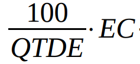

# Verificação de Personas

## Introdução

O presente documento apresentará a verificação do artefato [Personas](../../elicitacao/personas.md), desenvolvido pela equipe. A técnica de inspeção será aplicada para verificar esse artefato, de acordo com o planejamento estabelecido, na Tabela 1, se encontra os metadados desse artefato, nas tabelas 2 e 3 se encontram as questões a serem avaliadas.

<center>

| Versão avaliada | Autores            | Revisor |
| ---------------- | ------------------ | ------- |
| 1.4              | Chaydson e Gabriel | Lucas   |

</center>

<div style="text-align: center">
<p> Tabela 1: Versão avaliada. (Fonte: Henrique e Samuel, 2023). </p>
</div>

| ID |                                   Questão                                   | Inspeção |
| :-: | :--------------------------------------------------------------------------: | :--------: |
| 1 |                  As legendas estão no padrão do projeto?                  |     🟡     |
| 2 |                    Possui links para os outros artefatos?                    |     🔴     |
| 3 |                     Existe uma introdução no artefato?                     |     🟢     |
| 4 |                 Existe tabela de versionamento padronizado?                 |     🟢     |
| 5 | Há referências bibliográficas, bibliografia e referências no artefato? |     🟢     |
| 6 |  As tabelas e imagens possuem legenda, fonte e são introduzidas no texto?  |     🟢     |
| 7 |                           O artefato possui autor?                           |     🟢     |
| 8 |                          O artefato possui revisor?                          |     🟢     |

<div style="text-align: center">
<p> Tabela 2: Tabela de avaliação com as verificações gerais para todos os artefatos (Fonte: Henrique e Samuel, 2023). </p>
</div>

| Id | Questão                                                             | Inspeção |
| -- | -------------------------------------------------------------------- | ---------- |
| 9  | A definição de personas está correta?                             | 🟢         |
| 10 | A metodologia usada está correta?                                   | 🟡         |
| 11 | Está claro como as personas serão utilizadas no projeto?           | 🔴         |
| 12 | Foi justificado a quantidade de personas criadas?                    | 🟢         |
| 13 | As personas apresentam nome e sobrenome?                             | 🟢         |
| 14 | As personas estão dentro do artefato?                              | 🟢         |
| 15 | As personas possuem foto?                                            | 🟢         |
| 16 | As personas possuem dados demográficos?                             | 🟢         |
| 17 | As personas possuem status? (primária, secundária, antipersona...) | 🟢         |
| 18 | O objetivo das personas estão coerentes?                            | 🟢         |
| 19 | As personas possuem habilidades?                                     | 🟢         |
| 20 | As tarefas das personas estão corretas?                             | 🟢         |
| 21 | As personas possuem relacionamentos?                                 | 🟢         |
| 22 | As personas possuem requisitos?                                      | 🟢         |
| 23 | As personas possuem expectativas?                                    | 🟢         |
| 24 | As personas primárias não possuem elasticidade?                    | 🟡         |

<div style="text-align: center">
<p> Tabela 3: Tabela de avaliação com as questões específicas do artefato (Fonte: Henrique e Samuel, 2023). </p>
</div>

<center>

### Tarefas

| ID Correção | Tarefa                                                                                                                                                                                 |
| ------------- | -------------------------------------------------------------------------------------------------------------------------------------------------------------------------------------- |
| IDC1          | Colocar o link do artefato "perfil de usuário".                                                                                                                                       |
| IDC2          | Padronizar as legendas e colocar legenda nas fotos das personas.                                                                                                                       |
| IDC3          | Separar a metodologia da introdução.                                                                                                                                                 |
| IDC4          | Separar a explicação sobre o uso das personas da introdução, corrigir os erros de português e deixar mais específico como as personas serão utilizadas dentro do nosso projeto. |
| IDC5          | Seguir o conceito de solidez e tangibilidade[1]                                                                                                                                       |

<div style="text-align: center">
<p> Tabela 4: Tabela do que precisa ser ajustado (Fonte: Henrique e Samuel, 2023). </p>
</div>

</center>

## Acompanhamento

Para saber a porcentagem de aproveitamento do artefato, será utilizado a expressão da Figura 1, no qual a Tabela 5 apresenta o significado dessa legendas.

<div style="text-align: center">


<p> Figura 1: Fórmula para calcular aproveitamento (Fonte: Gabriel, 2023). </p>
</div>

<center>

| Acrônimo | Descrição                     |
| --------- | ------------------------------- |
| QTDE      | Quantidade Total de Exigências |
| EC        | Exigências Completas           |

<div style="text-align: center">
<p> Tabela 5: Legenda da Figura 1 (Fonte: Gabriel, 2023). </p>
</div>

</center>

### Porcentagem

Nos checklists realizados e que serão descritos, podemos observar que:

- 19/24 exigências são atendidas;
- 3/24 exigências estão incompletas;
- 2/24 exigências estão erradas ou não foram realizadas.
- 0/24 não se aplica.

```vegalite
{
    "title": "Acompanhamento",
  "$schema": "https://vega.github.io/schema/vega-lite/v5.json",
  "description": "A simple donut chart with embedded data.",
  "data": {
    "values": [
      {"legenda": "Completo", "value": 19},
      {"legenda": "Incompleto", "value": 3},
      {"legenda": "Errado ou não feito", "value": 2},
      {"legenda": "Não se aplica", "value": 0}
    ]
  },
  "mark": {"type": "arc", "innerRadius": 50, "tooltip": true},
  "encoding": {
    "theta": {"field": "value", "type": "quantitative"},
    "color": {
      "field": "legenda",
      "type": "nominal",
      "scale": {
        "domain": ["Completo", "Incompleto", "Errado ou não feito", "Não se aplica"],
        "range": ["green", "yellow", "red", "blue"]
      }
    }
  }
}
```

<div style="text-align: center">
<p> Gráfico 1: Gráfico de aproveitamento (Fonte: Samuel, 2023). </p>
</div>

Portanto, com base na formula apresentada, pode-se dizer que o aproveitamento deste artefato está em 79,17% correto.

## Correção

### Ajustes

Na tabela 6, se encontra os ajustes que o autor do artefato realizou para arrumar o que foi pedido na tabela 4

<center>

| ID Correção | Ajuste                       |
| ------------- | ---------------------------- |
| IDC1          | Foi ajustado x realizando... |
| IDC2          | Foi incluido x em ...        |
| IDC3          | Foi removido x ...           |
| IDC4          | X foi especificaod melhor... |

<div style="text-align: center">
<p> Tabela 6: Tabela de ajustes feitos (Fonte: Lucas, 2023). </p>
</div>

</center>

## Referência Bibliográfica

[1] Barbosa, S. D. J.; Silva, B. S. da; Silveira, M. S.; Gasparini, I.; Darin, T.; Barbosa, G. D. J. (2021) Interação Humano-Computador e Experiência do usuário. Autopublicação. ISBN: 978-65-00-19677-1.

## Bibliografia

SCHNEIDEWIND, Lydia et al. How personas support requirements engineering. In: 2012 First International Workshop on Usability and Accessibility Focused Requirements Engineering (UsARE). IEEE, 2012.

## Histórico de Versão

| Versão | Data       | Descrição                             | Autor(es)         |
| ------- | ---------- | --------------------------------------- | ----------------- |
| 1.0     | 21/06/2023 | Criação do documento de verificação | Henrique e Samuel |
